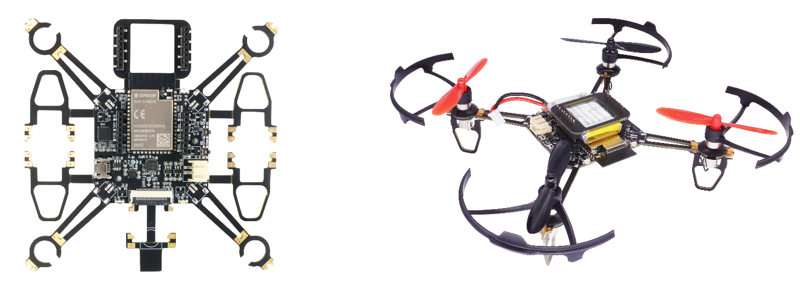


## ESP-Drone

* [English Version](./README.md)

### 简介

ESP-Drone 是基于乐鑫 ESP32-S2/ESP32 开发的小型无人机解决方案，可使用手机 APP 或游戏手柄通过 Wi-Fi 网络进行连接和控制。目前已支持自稳定飞行、定高飞行、定点飞行等多种模式。该方案硬件结构简单，代码架构清晰完善，方便功能扩展，可用于 STEAM 教育等领域。控制系统代码来自 Crazyflie 开源工程，使用 GPL3.0 开源协议。

* **从这里开始**: [Getting Started](https://docs.espressif.com/projects/espressif-esp-drone/zh_CN/latest/gettingstarted.html)
* **硬件原理图**：[Hardware](https://docs.espressif.com/projects/espressif-esp-drone/zh_CN/latest/_static/ESP32_S2_Drone_V1_2/SCH_Mainboard_ESP32_S2_Drone_V1_2.pdf)
* **iOS APP 源代码**: [ESP-Drone-iOS](https://github.com/EspressifApps/ESP-Drone-iOS)
* **Android APP 源代码**: [ESP-Drone-Android](https://github.com/EspressifApps/ESP-Drone-Android)

### 功能

1. 自稳定模式
2. 定高模式
3. 定点模式
4. APP 控制
5. 适配 cfclient 上位机 

注意，定高模式及定点模式需外接扩展板，详情见硬件参考。

### 第三方代码

第三方代码及证书如下：

| 组件 | License | 源代码 |Commit ID |
| :---:  | :---: | :---: |:---: |
| core/crazyflie | GPL-3.0 |[Crazyflie](https://github.com/bitcraze/crazyflie-firmware) |a2a26abd53a5f328374877bfbcb7b25ed38d8111|
| lib/dsp_lib |  | [esp32-lin](https://github.com/whyengineer/esp32-lin/tree/master/components/dsp_lib) |6fa39f4cd5f7782b3a2a052767f0fb06be2378ff|

### 致谢

1. 感谢 Bitcraze 开源组织提供很棒的 [Crazyflie](https://www.bitcraze.io/%20) 无人机项目代码；
2. 感谢乐鑫提供 ESP32 和 [ESP-IDF 操作系统](https://docs.espressif.com/projects/esp-idf/en/latest/esp32s2/get-started/index.html)；
3. 感谢 WhyEngineer 提供的 stm32 dsp 移植库 [esp-dsp](https://github.com/whyengineer/esp32-lin/tree/master/components/dsp_lib)。

