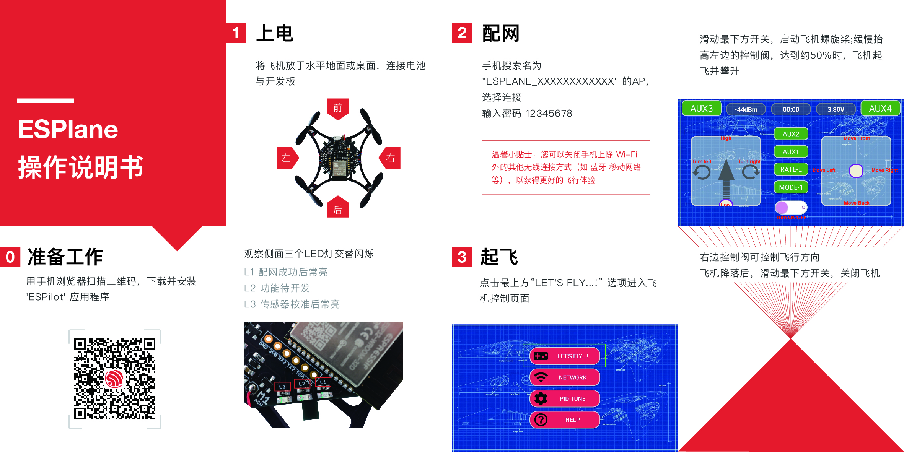


## ESP-Drone

**Drones powered by ESP32-S2&ESP\_IDF&Crazyflie**

### 简介

ESP-Drone 是基于乐鑫 `ESP32-S2 / ESP32` 开发的小型无人机解决方案，可使用手机 APP 或游戏手柄通过 Wi-Fi 网络进行连接和控制，目前已支持自稳定飞行、定高飞行、定点飞行等多种模式。该方案硬件结构简单，代码架构清晰完善,方便功能扩展，可用于STEAM教育等领域。控制系统代码来自 Crazyflie 开源工程，使用GPL3.0开源协议。

**For User**: [ESP-Drone Operate Guide](./docs/zh_CN/md/gettingstarted.md)

**For Developer**: [ESP-Drone Develop Guide](./docs/zh_CN/md/gettingstarted4developer.md)

### 已实现功能

1. 自稳定模式
2. 定高模式
3. 定点模式
4. APP 控制
5. 适配 cfclient 上位机 

>2.需要搭载气压或激光扩展模块 3. 需要搭载光流扩展模块   

### 第三方代码

Additional third party copyrighted code is included under the following licenses.

| Component | License | Origin |commit id |
| :---:  | :---: | :---: |:---: |
| core/crazyflie | GPL-3.0 |[Crazyflie](https://github.com/bitcraze/crazyflie-firmware) |a2a26abd53a5f328374877bfbcb7b25ed38d8111|
| lib/dsp_lib |  | [esp32-lin](https://github.com/whyengineer/esp32-lin/tree/master/components/dsp_lib) |6fa39f4cd5f7782b3a2a052767f0fb06be2378ff|

### 感谢/THANKS

1. 感谢Bitcraze开源组织提供很棒的[Crazyflie](https://www.bitcraze.io/%20)无人机项目代码
2. 感谢Espressif提供ESP32和[ESP-IDF操作系统](https://docs.espressif.com/projects/esp-idf/en/latest/esp32s2/get-started/index.html)
3. 感谢WhyEngineer提供的stm32 dsp移植库[esp-dsp](https://github.com/whyengineer/esp32-lin/tree/master/components/dsp_lib)

