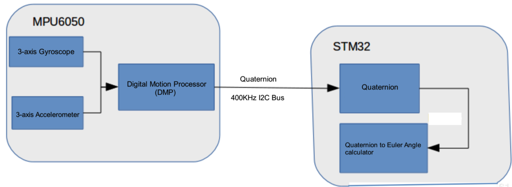

Drivers
========
:link_to_translation:`zh_CN:[中文]`

This section covers I2C drivers and SPI drivers used in ESP-Drone.

I2C Drivers
-------------

I2C drivers include MPU6050 sensor driver and VL53LXX sensor driver. The following part describes the two sensors in their main features, key registers and programming notes, etc.

MPU6050 Sensor
~~~~~~~~~~~~~~

Overview
^^^^^^^^^^^^^

The MPU6050 is a 6-axis Motion Tracking device that combines a 3-axis gyroscope, a 3-axis accelerometer, and a Digital Motion Processor (DMP).

How It Works
^^^^^^^^^^^^^

- Gyroscope: vibration occurs due to Coriolis effect when the gyroscope rotates around any sensing axis. Such vibration can be detected by a capacitive sensor. This capacitive sensor can amplify, demodulate, and filter such vibration signal, then generate a voltage proportional to the angular velocity.
- Accelerometer: when displacement accelerates along a specific axis over the corresponding detection mass, the capacitive sensor detects a change in capacitance.

Measure Range
^^^^^^^^^^^^^

- Gyroscope full-scale range: ±250 °/sec, ±500 °/sec, ±1000 °/sec, ±2000 °/sec
- Accelerometer full-scale range: ±2 g, ±4 g, ±8 g, ±16 g

AUX I2C Interface
^^^^^^^^^^^^^^^^^

- MPU6050 has an auxiliary I2C bus for communication with external 3-Axis magnetometer or other sensors.
- The AUX I2C interface supports two operation modes: I2C Master mode or Pass-Through mode.

MPU6050 FIFO
^^^^^^^^^^^^

The MPU6050 contains a 1024-byte FIFO register that is accessible via the Serial Interface. The FIFO configuration register determines which data is written into the FIFO. Possible choices include gyroscope data, accelerometer data, temperature readings, auxiliary sensor readings, and FSYNC input.

Digital Low-Pass Filter (DLPF)
^^^^^^^^^^^^^^^^^^^^^^^^^^^^^^

The MPU6050 has its own low-pass filter. Users can configure :ref:`MPU6050-Register-26` to control bandwidth, to lower high-frequency interference, but the configuration may reduce sensor input rate. Enable the DLPF: accelerometer outputs 1 kHz signal; disable the DLPF: accelerometer outputs 8 kHz signal.

Frame Synchronization Sampling Pin (FSYNC)
^^^^^^^^^^^^^^^^^^^^^^^^^^^^^^^^^^^^^^^^^^

The field EXT_SYNC_SET in Register 26 is used to configure the external Frame Synchronization (FSYNC) pin sampling.

Digital Motion Processing (DMP)
^^^^^^^^^^^^^^^^^^^^^^^^^^^^^^^^^

- The MPU6050 has its own DMP inside, which can be used to calculate quaternion to offload processing power from the main CPU.

- The DMP can trigger an interrupt via a pin.

   MPU6050 DMP

MPU6050 Orientation
^^^^^^^^^^^^^^^^^^^^^^^

The MPU6050 defines its orientation as follows.

.. figure:: ../../_static/mpu6050_xyz.png
   :align: center
   :alt: mpu6050_xyz
   :figclass: align-center

   MPU6050 Axis of X, Y, Z

MPU6050 Initialization
^^^^^^^^^^^^^^^^^^^^^^^^

1. Restore register defaults: 
  
  - Set PWR_MGMT_1 bit7 to 1, 
  - and then to 0 after register defaults are restored. 
  - Bit6 is automatically set to 1, putting MPU6050 into sleep mode;

2. Set PWR_MGMT_1 bit6 to 0, to wake up the sensor;
3. Set the clock source;
4. Set the range for the gyroscope and accelerometer;
5. Set the sample rate;
6. Set Digital Low-Pass Filter (optional).

MPU6050 Key Registers
^^^^^^^^^^^^^^^^^^^^^^^

Typical Register Values
'''''''''''''''''''''''''

.. list-table:: 
   :widths: 25 25 50
   :header-rows: 1

   * - Register
     - Typical Value
     - Feature
   * - PWR_MGMT_1
     - 0x00
     - Normal Enable
   * - SMPLRT_DIV
     - 0x07
     - Gyroscope sample rate: 125 Hz  
   * - CONFIG
     - 0x06
     - DLPF filter frequency: 5 Hz  
   * - GYRO_CONFIG
     - 0x18
     - Gyroscope does not conduct self-test, and its full-scale output is ±2000 °/s  
   * - ACCEL_CONFIG
     - 0x01
     - Accelerometer does not conduct self-test, and its full-scale output is ±2 g.   

Register 117 WHO_AM_I - Device Address
'''''''''''''''''''''''''''''''''''''''

Bits [6:1] store the device address, and default to 0x68. The value of the AD0 pin is not reflected in this register.

.. figure:: ../../_static/REG_75.png
   :align: center
   :alt: WHO_AM_I
   :figclass: align-center

Register 107 PWR_MGMT_1 - Power Management 1
''''''''''''''''''''''''''''''''''''''''''''
.. figure:: ../../_static/REG_6B.png
   :align: center
   :alt: PWR_MGMT_1
   :figclass: align-center

- DEVICE_RESET: if this bit is set, the register will use the default value.
- SLEEP: if this bit is set, MPU6050 will be put into sleep mode.
- CYCLE: when this bit (CYCLE) is set to 1 while SLEEP is disabled, the MPU6050 will be put into Cycle mode. In Cycle mode, the MPU6050 cycles between sleep mode and waking up to take a single sample of data from active sensors at a rate determined by LP_WAKE_CTRL (Register 108).

.. _MPU6050-Register-26:

Register 26 CONFIG - Configure DLPF
'''''''''''''''''''''''''''''''''''''

.. figure:: ../../_static/REG_1A.png
   :align: center
   :alt: CONFIG
   :figclass: align-center

The DLPF is configured by DLPF_CFG. The accelerometer and gyroscope are filtered according to the value of DLPF_CFG as shown in the table below.

.. figure:: ../../_static/DLPF_CFG.png
   :align: center
   :alt: DLPF
   :figclass: align-center

Register 27 - GYRO_CONFIG - Configure Gyroscope’s Full-Scale Range
'''''''''''''''''''''''''''''''''''''''''''''''''''''''''''''''''''

.. figure:: ../../_static/REG_1B.png
   :align: center
   :alt: GYRO_CONFIG
   :figclass: align-center

- XG_ST: if this bit is set, X-axis gyroscope performs self-test.
- FS_SEL: select the full scale of the gyroscope, see the table below for details.

.. figure:: ../../_static/FS_SEL.png
   :align: center
   :alt: FS_SEL
   :figclass: align-center

Register 28 ACCEL_CONFIG - Configure Accelerometer’s Full-Scale Range
''''''''''''''''''''''''''''''''''''''''''''''''''''''''''''''''''''''

Users can configure the full-scale range for the accelerometer according to the table below.

.. figure:: ../../_static/REG_1C.png
   :align: center
   :alt: ACCEL_CONFIG
   :figclass: align-center

.. figure:: ../../_static/AFS_SEL.png
   :align: center
   :alt: AFS_SEL
   :figclass: align-center

Register 25 SMPRT_DIV - Sample Rate Divider
'''''''''''''''''''''''''''''''''''''''''''''''

The register specifies the divider from the gyroscope output rate used to generate the Sample Rate for the MPU6050. The sensor register output, FIFO output, and DMP sampling are all based on the Sample Rate. The Sample Rate is generated by dividing the gyroscope output rate by (1 + SMPLRT_DIV).

.. figure:: ../../_static/REG_19.png
   :align: center
   :alt: SMPRT_DIV
   :figclass: align-center

..

   Sample Rate = Gyroscope Output Rate / (1 + SMPLRT_DIV)

Gyroscope Output Rate = 8 kHz when the DLPF is disabled (DLPF_CFG = 0 0r 7), and 1 kHz when the DLPF is enabled (see Register 26). Note: if SMPLRT_DIV is set to 7 when the DLPF is disabled, the chip can generate an interrupt signal of 1 kHz.

.. figure:: ../../_static/mpu6050_int_plot.png
   :align: center
   :alt: SMPLRT_DIV=7
   :figclass: align-center

Registers 59 ~ 64 - Accelerometer Measurements
'''''''''''''''''''''''''''''''''''''''''''''''''

.. figure:: ../../_static/REG_3B_40.png
   :align: center
   :alt: REG_3B_40
   :figclass: align-center

- Save data in big-endian: higher data bits are stored at low address, and lower bits at high address.
- Save data in complement: the measurement value is a signed integer, so it can be stored in complement.

Registers 65 ~ 66 - Temperature Measurement
'''''''''''''''''''''''''''''''''''''''''''''

.. figure:: ../../_static/REG_41_42.png
   :align: center
   :alt: REG_41_42
   :figclass: align-center

Registers 67 ~ 72 - Gyroscope Measurements
''''''''''''''''''''''''''''''''''''''''''''

.. figure:: ../../_static/REG_43_48.png
   :align: center
   :alt: REG_43_48
   :figclass: align-center

VL53LXX Sensor
~~~~~~~~~~~~~~

**Overview**

VL53L1X is a Time-of-Flight ranging and gesture detection sensor provided by ST.

**How It Works**

The VL53L0X/VL53L1X chip is internally integrated with a laser transmitter and a SPAD infrared receiver. By detecting the time difference between photon sending and receiving, the chip calculates the flight distance of photons, and the maximum measuring distance can reach two meters, which is suitable for short- and medium-range measurement applications.

.. figure:: ../../_static/vl53l1x_package.png
   :align: center
   :alt: VL53LXX
   :figclass: align-center

   VL53LXX

**Measurement Area - Region-of-Interest (ROI)**

The VL53L0X/VL53L1X measures the shortest distance in the measurement area, which can be zoomed in or out depending on actual scenario. But a large detection range may cause fluctuations in the measurement.

For more information about configuration on measurement area, see the sections 2.4 Ranging Description and 2.8 Sensing Array Optical Center in `VL53LXX Datasheet <https://www.st.com/resource/en/datasheet/vl53l1x.pdf>`_.

.. figure:: ../../_static/vl53lxx_roi.png
   :align: center
   :alt: ROI
   :figclass: align-center

   ROI

**Measure Distance**

- The VL53L0X sensor has a blind spot of **3 ~ 4 cm**, with an effective measurement range of 3 ~ 200 cm and an accuracy of ±3%.
- The VL53L1X is an upgraded version of the VL53L0X with a detection distance of up to 400 cm.

.. list-table:: 
   :widths: 5 5 5 35
   :header-rows: 1

   * - Precision Mode
     - Measuring Time (ms)
     - Measuring Range (m)
     - Applications
   * - Default
     - 30
     - 1.2
     - Standard
   * - High Precision
     - 200
     - 1.2 <+-3%
     - Precise distance measurement
   * - Long Range
     - 33
     - 2
     - Long distance, only works in dark environment
   * - High Speed
     - 20
     - 1.2 +-5%
     - Speed priority with low precision

-  VL53LXX measurement distance/performance is related to the environment. The detection distance is farther in the dark conditions. But in outdoor bright conditions, the laser sensor may be subject to a lot of interference, resulting in reduced measurement accuracy. For such reason, the height should be set based on the outdoor air pressure.

.. figure:: ../../_static/vl53l1x_max_distance.png
   :align: center
   :alt: VL53L1X mode
   :figclass: align-center

**Measurement Frequency**

- The VL53L0X ranging frequency is up to 50 Hz, with a measurement error of ±5%.
- The VL53L1X I2C has a maximum clock frequency of 400 kHz, and the pull-up resistor needs to be selected based on voltage and bus capacitance values. For more information, see `VL53LXX Datasheet <https://www.st.com/resource/en/datasheet/vl53l1x.pdf>`__\.

.. figure:: ../../_static/vl53l1x_typical_circuit.png
   :align: center
   :alt: vl53l1x
   :figclass: align-center

   VL53L1X

- XSHUT, input pin for mode selection (sleep), must always be driven to avoid leakage current. A pull-up resistor is needed.
- GPIO1, interrupt output pin for measuring dataready interrupts.

**Work Mode**

By setting the level of the XSHUT pin, the sensor can be switched into HW Standby mode or SW Standby mode for conditional boot and for lowering the standby power consumption. If the host gives up the management of sensor modes, the XSHUT pin can be set to pull up by default.

- HW Standby: XSHUT pulls down and the sensor power is off.
- SW Standby: XSHUT pulls up, then the sensor enters Boot and SW Standby modes.

.. figure:: ../../_static/vl53lxx_power_up_sequence.png
   :align: center
   :alt: HW Standby
   :figclass: align-center

   HW Standby

.. figure:: ../../_static/vl53lxx_boot_sequence.png
   :align: center
   :alt: SW Standby
   :figclass: align-center

   SW Standby

VL53LXX Initialization
^^^^^^^^^^^^^^^^^^^^^^^

1. Wait for the initialization of the hardware to complete
2. Data initialization
3. Static initialization, loading data
4. Set ranging mode
5. Set the maximum wait time for a single measurement
6. Set the measurement frequency (interval)
7. Set measurement area ROI (optional)
8. Start the measurement

.. code:: text

   /*init  vl53l1 module*/
   void vl53l1_init()
   {

       Roi0.TopLeftX = 0;    //Measurement target area (optional). Min: 4*4, Max: 16*16.
       Roi0.TopLeftY = 15;
       Roi0.BotRightX = 7;
       Roi0.BotRightY = 0;
       Roi1.TopLeftX = 8;
       Roi1.TopLeftY = 15;
       Roi1.BotRightX = 15;
       Roi1.BotRightY = 0;

       int status = VL53L1_WaitDeviceBooted(Dev); // Wait for the initialization of the hardware to complete
       status = VL53L1_DataInit(Dev); // Data initialization, is executed immediately after wake up; 
       status = VL53L1_StaticInit(Dev); // Static initialization, loading parameters.
       status = VL53L1_SetDistanceMode(Dev, VL53L1_DISTANCEMODE_LONG);// Set ranging mode;
       status = VL53L1_SetMeasurementTimingBudgetMicroSeconds(Dev, 50000); // Set the maximum wait time based on the measurement mode.
       status = VL53L1_SetInterMeasurementPeriodMilliSeconds(Dev, 100); // Set the measurement interval.

       status = VL53L1_SetUserROI(Dev, &Roi0); //Set measurement area ROI
       status = VL53L1_StartMeasurement(Dev); //Start the measurement
       if(status) {
           printf("VL53L1_StartMeasurement failed \n");
           while(1);
       }    

   }

Note: except the step VL53L1_SetUserROI, the other initialization steps can not be skipped.

VL53LXX Ranging Step
^^^^^^^^^^^^^^^^^^^^

The ranging can be done in two kinds of modes: polling mode and interrupt mode.

**Polling Mode Workflow**

.. figure:: ../../_static/vl53lxx_meaturement_sequence.png
   :align: center
   :alt: vl53lxx_meaturement_sequence
   :figclass: align-center

   VL53LXX Measurement Sequence

.. note::

    - Each time when the measurement and value reading are done, clear the interrupt flag using ``VL53L1_ClearInterruptAndStartMeasurement``, and then start the measurement again.
    - Polling mode provides two methods as shown in the figure above: Drivers polloing mode and Host polling mode. We take the Drivers polling mode as an example.

.. code:: text

   /* Autonomous ranging loop*/
   static void
   AutonomousLowPowerRangingTest(void)
   {
       printf("Autonomous Ranging Test\n");

       static VL53L1_RangingMeasurementData_t RangingData;
       VL53L1_UserRoi_t Roi1;
       int roi = 0;
       float left = 0, right = 0;
       if (0/*isInterrupt*/) {
       } else {
           do // polling mode
               {
                   int status = VL53L1_WaitMeasurementDataReady(Dev); // Waiting for the measurement result
                   if(!status) {
                       status = VL53L1_GetRangingMeasurementData(Dev, &RangingData); // Get a single measurement data
                       if(status==0) {
                           if (roi & 1) {
                               left = RangingData.RangeMilliMeter;
                               printf("L %3.1f R %3.1f\n", right/10.0, left/10.0);
                           } else
                               right = RangingData.RangeMilliMeter;
                       }
                       if (++roi & 1) {
                           status = VL53L1_SetUserROI(Dev, &Roi1);
                       } else {
                           status = VL53L1_SetUserROI(Dev, &Roi0);
                       }
                       status = VL53L1_ClearInterruptAndStartMeasurement(Dev); // Release the interrupt
                   }
               }
           while (1);
       }
       //  return status;
   }

**Interrupt Mode Workflow**

Interrupt is controlled by the pin GPIO1. When the data is ready, pulling down GPIO1 can inform the host to read the data.

.. figure:: ../../_static/vl53lxx_sequence.png
   :align: center
   :alt: vl53lxx autonomous sequence
   :figclass: align-center

   VL53LXX Autonomous Sequence

VL53LXX Sensor Calibration
^^^^^^^^^^^^^^^^^^^^^^^^^^

If a mask is installed over the sensor receiver, or if the sensor is mounted behind a transparent cover, the sensor needs to be calibrated due to changes in the transmission rate. You can write a calibration program and call APIs based on the calibration process, or you can measure the calibration value directly using the official PC GUI.

**Use Official APIs to Write Calibration Program**

Calibration process is shown below. The order of calls should be exactly the same.

.. figure:: ../../_static/vl53lxx_calibration_sequence.png
   :align: center
   :alt: vl53lxx_calibration_sequence
   :figclass: align-center

   VL53LXX Calibration Sequence

::

   /* VL53L1 Module Calibration*/
   static VL53L1_CalibrationData_t vl53l1_calibration(VL53L1_Dev_t *dev)
   {
       int status;
       int32_t targetDistanceMilliMeter = 703;
       VL53L1_CalibrationData_t calibrationData;
       status = VL53L1_WaitDeviceBooted(dev);
       status = VL53L1_DataInit(dev);                                       // Device initialization
       status = VL53L1_StaticInit(dev);                                     // Load device settings for a given use case.
       status = VL53L1_SetPresetMode(dev,VL53L1_PRESETMODE_AUTONOMOUS);
       status = VL53L1_PerformRefSpadManagement(dev);
       status = VL53L1_PerformOffsetCalibration(dev,targetDistanceMilliMeter);
       status = VL53L1_PerformSingleTargetXTalkCalibration(dev,targetDistanceMilliMeter);
       status = VL53L1_GetCalibrationData(dev,&calibrationData);

       if (status)
       {
           ESP_LOGE(TAG, "vl53l1_calibration failed \n");
           calibrationData.struct_version = 0;
           return calibrationData;

       }else
       {
           ESP_LOGI(TAG, "vl53l1_calibration done ! version = %u \n",calibrationData.struct_version);
           return calibrationData;
       }

   }

**Use the Official PC GUI to Calibrate the Sensor**

STM has provided a PC GUI to configure and calibrate the sensor. 

- Connect the sensor to ``STM32F401RE nucleo`` development board provided by STM.
- Use softwere to conduct calibration, and get the reference value.
- Enter this value during initialization.

.. figure:: ../../_static/vl53lxx_calibrate_gui.png
   :align: center
   :alt: STSW-IMG008
   :figclass: align-center

   PC GUI Calibration

For more information, see `STSW-IMG008: Windows Graphical User Interface (GUI) for VL53L1X Nucleo packs. Works with P-NUCLEO-53L1A1 <https://www.st.com/content/st_com/en/products/embedded-software/proximity-sensors-software/stsw-img008.html>`__\.

VL53L1X Example
^^^^^^^^^^^^^^^^

**Example Description**

- Implementation: VL53L1X detects the height changes (last for 1 second) and the red light turns on. Height returns to normal value (last for 1 second), and the green light turns on.
- Parameters: set the I2C number, port number, LED port number via ``make menuconfig``.
- Example analysis can be found in code notes and user manual.

**Notes**

- This example applies only to VL53L1X, not to its older version hardware VL53L0X.
- According to STM document, the measurement distance is 400 cm in dark environment. In indoor environment, the measurement distance can be 10 to 260 cm.
- Some of the parameters in the initialization function ``vl53l1\_init (VL53L1\_Dev\_t \*)`` need to be determined according to the actual usage environment, and there is room for optimization.
- Make sure the sensor is installed right above the detection position.
- Base height is automatically calibrated when the module is powered on. If the base height changes, the parameters need to be reset again.

**Example Repository**

Click `esp32-vl53l1x-test <https://github.com/qljz1993/esp32-vl53l1x-test/tree/master>`__ to check the example, or download the example using git tool:

.. code:: text

   git clone https://github.com/qljz1993/esp32-vl53l1x-test.git

SPI Driver
-----------

PMW3901 Sensor
~~~~~~~~~~~~~~

Overview
^^^^^^^^^^

The PMW3901 is PixArt's latest high-precision, low-power optical navigation module that provides
X-Y motion information with a wide range of 8 cm to infinity. The PWM3901 works with an operating current of less than 9 mA, an operating voltage of VDD (1.8 to 2.1 V), a VDDIO (1.8 to 3.6 V), and uses a 4-wire SPI interface for communication.

**Main Parameters**

==================   =======================================
Parameter            Value
==================   =======================================
Supply voltage (V)   VDD: 1.8 ~ 2.1 V; VDDIO: 1.8 ~ 3.6 V
Working range (mm)   80 ~ +∞
Interface            4-line SPI @ 2 MHz
Package              28-pin COB package, size: 6 x 6 x 2.28 mm
==================   =======================================

**Package and Pin Layout**

.. figure:: ../../_static/pmw3901_package.png
   :align: center
   :alt: pmw3901_package
   :figclass: align-center

   PMW3901 Package

.. figure:: ../../_static/pmw3901_pinmap.png
   :align: center
   :alt: pmw3901_pinmap
   :figclass: align-center

   PMW3901 Pinmap

The sensor works at a low operating voltage and to communicates with the ESP32 at 3.3 V requires different voltages from VDD and VDDIO. 

Power States and Sequence
^^^^^^^^^^^^^^^^^^^^^^^^^^^^^

**Power-Up Sequence**

Although PMW3901MB performs an internal power up self-reset, it is still recommended that the Power_Up_Reset register is written every time power is applied. The appropriate sequence is as follows:

1. Apply power to VDDIO first and followed by VDD, with a delay of no more than 100 ms in between each supply. Ensure all supplies are stable.
2. Wait for at least 40 ms.
3. Drive NCS high, and then low to reset the SPI port.
4. Write 0x5A to Power_Up_Reset register (or alternatively, toggle the NRESET pin).
5. Wait for at least 1 ms.
6. Read from registers 0x02, 0x03, 0x04, 0x05, and 0x06 one time regardless of the motion pin state.
7. Refer to PWM3901MB Datasheet Section 8.2 Performance Optimization Registers to configure the required registers to achieve optimum performance of the chip.

**Power-Down Sequence**

PMW3901MB can be set to Shutdown mode by writing to Shutdown register. The SPI port should not be accessed when Shutdown mode is asserted, except the power-up command (writing 0x5A to register 0x3A). Other ICs on the same SPI bus can be accessed, as long as the chip’s NCS pin is not asserted.

To de-assert Shutdown mode:

1. Drive NCS high, and then low to reset the SPI port.
2. Write 0x5A to Power_Up_Reset register (or alternatively, toggle the NRESET pin).
3. Wait for at least 1 ms.
4. Read from registers 0x02, 0x03, 0x04, 0x05, and 0x06 one time regardless of the motion pin state.
5. Refer to PWM3901MB Datasheet Section 8.2 Performance Optimization Registers to configure the required registers for optimal chip performance.

For more information, see `Connected Home Appliances and IoT <https://www.pixart.com/applications/11/Connected_Home_Appliances_%EF%BC%86_IoT>`__.

Code Interpretation
^^^^^^^^^^^^^^^^^^^^

**Key Structs**

::

   typedef struct opFlow_s 
   {
       float pixSum[2]; /*accumulated pixels*/
       float pixComp[2]; /*pixel compensation*/
       float pixValid[2]; /*valid pixels*/
       float pixValidLast[2]; /*last valid pixel*/
       float deltaPos[2]; /*displacement between 2 frames, unit: cm*/
       float deltaVel[2]; /*velocity, unit: cm/s*/
       float posSum[2]; /*accumulated displacement, unit: cm*/
       float velLpf[2]; /*low-pass velocity, unit cm/s*/
       bool isOpFlowOk; /*optical flow*/
       bool isDataValid; /* valid data */
   } opFlow_t;

- Accumulated pixels: accumulated pixels after the drone takes off.
- Pixel compensation: compensation for pixel error caused by drone tilt.
- Valid pixels: the actual pixels that have been compensated.
- Displacement between 2 frames: the actual displacement converted from pixels, unit: cm.
- Velocity: instantaneous velocity, obtained by differentiating on displacement changes, unit: cm/s.
- Accumulated displacement: actual displacement, unit: cm.
- Low-pass velocity: low-pass operation on velocity increases data smoothness.
- Optical flow status: check if this optical flow sensor is working properly.
- Valid data: data is valid at a certain height.

::

   typedef struct motionBurst_s {
     union {
       uint8_t motion;
       struct {
         uint8_t frameFrom0    : 1;
         uint8_t runMode       : 2;
         uint8_t reserved1     : 1;
         uint8_t rawFrom0      : 1;
         uint8_t reserved2     : 2;
         uint8_t motionOccured : 1;
       };
     };

     uint8_t observation;
     int16_t deltaX;
     int16_t deltaY;

     uint8_t squal;

     uint8_t rawDataSum;
     uint8_t maxRawData;
     uint8_t minRawData;

     uint16_t shutter;
   } __attribute__((packed)) motionBurst_t;

- motion: motion information, can be obtained according to the bits frame detection (frameFrom0), operating mode (runMode) and motion detection (motionOccured).
- observation: to check if the IC has EFT/B or ESD issues. When the sensor works properly, the value should be 0xBF.
- deltaX and deltaY: the sensor has detected the motion of the image at X and Y directions.
- squal: the quality of motion information, i.e, the credibility of motion information;
- rawDataSum: the sum of raw data, can be used to average the data of a frame.
- maxRawData and minRawData: the maximum and minimum of the raw data;
- shutter: a real-time auto-adjusted value, to ensure that the average motion data remains within the normal operating range. Shutter can be used together with ``squal`` to check whether the motion information is available.

Programming Notes
^^^^^^^^^^^^^^^^^^^^

- If the sensor data is 0 and lasts for 1 second, it indicates that an error occurs. If so, optical flow tasks should be suspended.
- The sensor lens must be mounted facing down. Due to relative motion, the displacement data collected by the sensor is opposite to the actual motion direction of the drone.
- Enable position-hold mode only when the height-hold mode test is stable. Accurate height information is used to determine the relation between image pixels and actual distance.
- Manual test on tilt compensation can remain the sensor output nearly unchanged even when the drone tilts on certain direction.  
- With tilt compensation and motion accumulated pixels, the actual accumulated pixels can be obtained. After several calculations, you can get:

   - Pixel changes between 2 frames = actual accumulated pixels - last actual pixels;
   - Displacement changes between 2 frames = Pixel changes between 2 frames x coefficient. Note when the height is less than 5 cm, the optical flow will stop working, so the coefficient should be set to 0;
   - Integrate on the above displacement changes, to obtain the displacement from the four axes to the take-off point. Differentiate on the above displacement changes, to obtain the instantaneous velocity. Conduct low-pass operation on velocity, to increase data smoothness. Limit amplitude on velocity, to enhance data security.

- The position and velocity information of the four axes are obtained through the optical flow, and then:

   - The above location and speed information together with the accelerometer (state_estimator.c) can be used to estimate the position and speed;
   - Estimated position and speed are involved in PID operations and can be used for horizontal position control. Refer to position_pid.c to see how the position ring and speed ring PID are handled.

Finally, horizontal position-hold control can be achieved through the above process.
