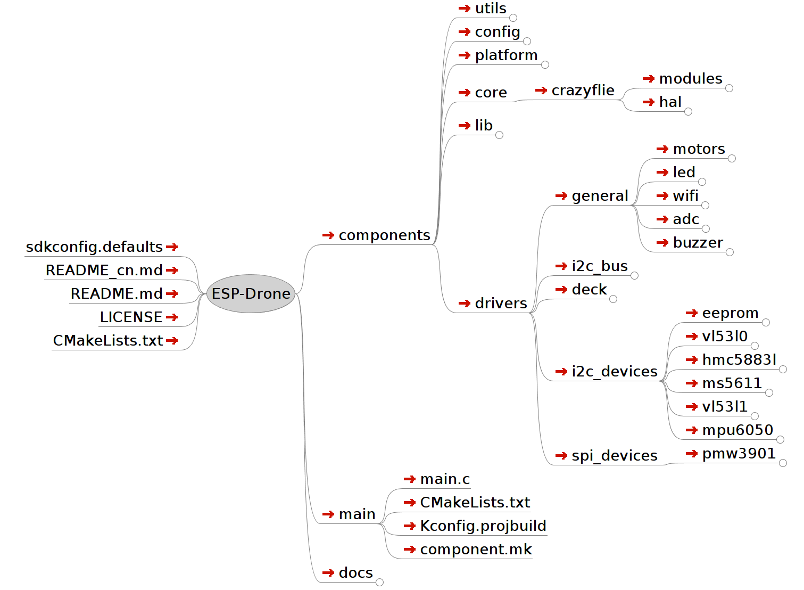

Set up Development Environment
================================

Set up ESP-IDF Environment 
---------------------------------

Please refer to `ESP-IDF Programming Guide <https://docs.espressif.com/projects/esp-idf/en/latest/esp32s2/get-started/index.html>`__\  and set up ESP-IDF environmnet step by step.

Note：

-  Please follow the link above and complete all the steps.
-  Build one or more sample applications by following the steps in the link above.

Modify ESP32/ESP32-S2 Link Script
--------------------------------------

Open the link script template for ESP32/ESP32-S2 ``${IDF_PATH}/components/esp32/ld/esp32.project.ld.in`` and ``${IDF_PATH}/components/esp32s2/ld/esp32s2.project.ld.in``\. Put the following code at the end of ``.flash.rodata``.

::

      /* Parameters and log system data */
       _param_start = .;
       KEEP(*(.param))
       KEEP(*(.param.*))
       _param_stop = .;
       . = ALIGN(4);
       _log_start = .;
       KEEP(*(.log))
       KEEP(*(.log.*))
       _log_stop = .;
       . = ALIGN(4);

The above code can place variables with ``.param.*`` or ``.log.*`` segment attributes at continuous storage area so as to speed up variable traversal. 

Get Project Source Code 
---------------------------------------------------

**Beta code, currently in the GitHub repository, is available by using git:**

::

   git clone https://github.com/espressif/esp-drone.git

**The project software mainly consists of a flight control kernel, hardware drivers, and dependency libraries:**

-  The flight control kernel is from Crazyflie, mainly including hardware abstraction layer and flight control program.
-  Hardware drivers are structured in files according to hardware interfaces, including I2C devcies and SPI devices.
-  Dependency libraries include the default components provided by ESP-IDF, as well as DSP from third parties.

**The code file structure is as follows:**

   espdrone_file_structure

::

   .
   ├── components                        | project components directory
   │   ├── config                              | system task configuration
   │   │   └── include
   │   ├── core                                 | system kernel directory
   │   │   └── crazyflie                  | Crazyflie kernel
   │   │       ├── hal                         | hardware abstraction code
   │   │       └── modules             |  flight control code 
   │   ├── drivers                            | hardware driver directory
   │   │   ├── deck                         | hardware extention interface driver
   │   │   ├── general                    | general device directory
   │   │   │   ├── adc                     | ADC driver for voltage monitoring
   │   │   │   ├── buzzer              | buzzer driver for status feedback
   │   │   │   ├── led                     | LED driver for status feedback
   │   │   │   ├── motors             | motor driver for thrust output
   │   │   │   └── wifi                    | Wi-Fi driver for communication
   │   │   ├── i2c_bus                   | I2C driver
   │   │   ├── i2c_devices           | I2C device directory
   │   │   │   ├── eeprom           | EEPROM driver for parameter storage
   │   │   │   ├── hmc5883l         | HMC5883l magnetic compass sensor
   │   │   │   ├── mpu6050          | MPU6050 gyroscopic accelerometer sensor
   │   │   │   ├── ms5611             | MS5611 air pressure sensor
   │   │   │   ├── vl53l0                 | Vl53l0 laser sensor (maximum distance 2 m)
   │   │   │   └── vl53l1                 |  Vl53l1 laser sensor（maximum distance 4 m）
   │   │   └── spi_devices           | SPI devices directory
   │   │       └── pmw3901           | PMW3901 optical flow sensor
   │   ├── lib                                      | external repository directory
   │   │   └── dsp_lib                    | DSP repository
   │   ├── platform                         | support multi-platform
   │   └── utils                                  | utility function directory
   ├── CMakeLists.txt                    | utility function
   ├── LICENSE                                | open source protocol
   ├── main                                       | entry function
   ├── README.md                        | project description
   └── sdkconfig.defaults            | default parameter

**For more information, please refer to**\ ：\ `espdrone_file_structure <./_static/espdrone_file_structure.pdf>`__\ 

Source Code Style
--------------------

**Two ways to search the same area（union)**

The same memory area can be searched in two ways:

.. code:: text

    typedef union {
      struct {
            float x;
            float y;
            float z;
      };
      float axis[3];
    } Axis3f;

**Counting using enumeration types**

The first member in an enumeration defaults to 0, so the member SensorImplementation_COUNT can always represent the total number of defined enumeration members before it.

.. code:: text

   typedef enum {  
     #ifdef SENSOR_INCLUDED_BMI088_BMP388
     SensorImplementation_bmi088_bmp388,
     #endif

     #ifdef SENSOR_INCLUDED_BMI088_SPI_BMP388
     SensorImplementation_bmi088_spi_bmp388,
     #endif

     #ifdef SENSOR_INCLUDED_MPU9250_LPS25H
     SensorImplementation_mpu9250_lps25h,
     #endif

     #ifdef SENSOR_INCLUDED_MPU6050_HMC5883L_MS5611
     SensorImplementation_mpu6050_HMC5883L_MS5611,
     #endif

     #ifdef SENSOR_INCLUDED_BOSCH
     SensorImplementation_bosch,
     #endif

     SensorImplementation_COUNT,
   } SensorImplementation_t;

**Packed Data Type**

.. code:: text

   struct cppmEmuPacket_s {
     struct {
         uint8_t numAuxChannels : 4;   // Set to 0 through MAX_AUX_RC_CHANNELS
         uint8_t reserved : 4;
     } hdr;
     uint16_t channelRoll;
     uint16_t channelPitch;
     uint16_t channelYaw;
     uint16_t channelThrust;
     uint16_t channelAux[MAX_AUX_RC_CHANNELS];
   } __attribute__((packed));

The purpose of ``__attribute__ ((packed))`` is to disable the optimized alignment when compiling ``struct``. By such way, ``struct`` is aligned based on its actual bytes. This is a syntax specific to GCC, which has nothing to do with your operating system but has to do with compiler. In Windows operating system, GCC and VC compiler do not support packed mode while TC compiler supports such mode.

.. code:: text

   In TC：struct my{ char ch; int a;} sizeof(int)=2;sizeof(my)=3; (compact mode)
   In GCC：struct my{ char ch; int a;} sizeof(int)=4;sizeof(my)=8; (non-compact mode)
   In GCC：struct my{ char ch; int a;}__attrubte__ ((packed)) sizeof(int)=4;sizeof(my)=5
