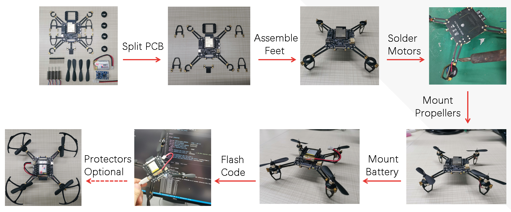
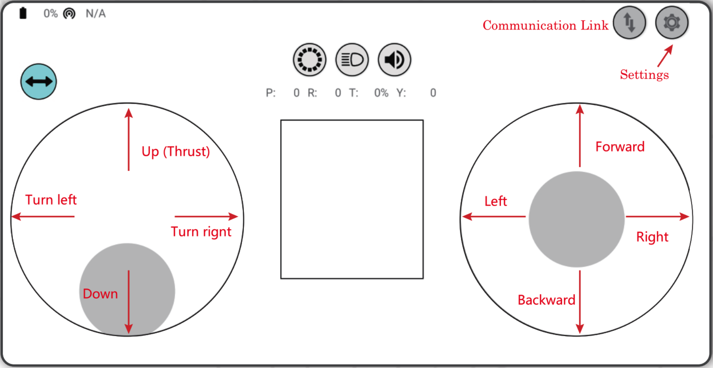

================
Get Started 
================

:link_to_translation:`zh_CN:[中文]`

ESP-Drone Overview
======================

ESP-Drone is an ESP32/ESP32-S2 based flying development board provided by Espressif. ESP-Drone is equipped with Wi-Fi key features, which allows this drone to be connected to and controlled by an APP or a gamepad over a Wi-Fi network. This drone comes with simple-structured hardware, clear codes, and supports functional extension. Therefore, ESP-Drone can be used in STEAM education. Part of the codes is from Crazyflie open source project under GPL3.0
license.

.. figure:: ../../_static/espdrone_s2_v1_2_2.png
   :align: center
   :alt: ESP-Drone
   :figclass: align-center
   
   ESP-Drone


Main Features
----------------

ESP-Drone supports the following features:

- Stabilize mode: keep the drone stable to achieve smooth flight.
- Height-hold mode: control thrust output to keep the drone flying at a fixed height.
- Position-hold mode: keep the drone flying at its current position.
- PC debugging: uses cfclient for static/dynamic debugging.
- Controlled by APP: easily controlled over Wi-Fi by your mobile APP.
- Controlled by gamepad: easily controlled via the gamepad by cfclient.

Main Components
----------------

ESP-Drone 2.0 consists of a main board and several extension boards:

-  **Main board**: integrates an ESP32-S2 module, necessary sensors for basic flight, and provides hardware extension interfaces.
-  **Extension boards**: integrates extension sensors via hardware extension interfaces of the main board, to implement advanced flight.  

.. list-table:: 
   :widths: 4 20 15 15 10 10
   :header-rows: 1

   * - No.
     - Modules
     - Main Components
     - Function
     - Interfaces
     - Mount Location
   * - 1
     - Main board - **ESP32-S2**
     - ESP32-S2-WROVER + MPU6050
     - Basic flight
     - I2C, SPI, GPIO extension interfaces
     - 
   * - 2
     - Extension board - **Position-hold module**
     - PMW3901 + VL53L1X
     - Indoor position-hold flight
     - SPI + I2C
     - Mount at bottom, facing to the ground.
   * - 3
     - Extension board - **Pressure module**
     - MS5611 pressure module
     - Height-hold flight
     - I2C or MPU6050 slave
     - Mount at the top or at the bottom
   * - 4
     - Extension board - **Compass module**
     - HMC5883 compass
     - Advanced flight mode, such as head-free mode
     - I2C or MPU6050 slave
     - Mount at the top or at the bottom


For more information, please refer to `Hardware Reference <./hardware.rst>`__.

ESP-IDF Overview
================

ESP-IDF is the IoT Development Framework provided by Espressif for ESP32/ESP32-S2.

- ESP-IDF is a collection of libraries and header files that provides the core software components that are required to build any software projects on ESP32/ESP32-S2.

- ESP-IDF also provides tools and utilities that are required for typical developer and production use cases, like build, flash, debug and measure. 


For more information, please check `ESP-IDF
Programming Guide <https://docs.espressif.com/projects/esp-idf/zh_CN/latest/esp32s2/get-started/index.html>`__.

Crazyflie Overview
=======================

Crazyflie is a Bitcraze open-source quadcopter, with the following features:

- Support various sensor combinations for advanced flight modes, such as Height-hold mode and Position-hold mode.
- Based on FreeRTOS, which allows users to break down complex drone systems into multiple software tasks with various priorities.
- Customized full-featured cfclient and CRTP communication protocol, for debug, measurement, and control purposes.

.. figure:: ../../_static/crazyflie-overview.png
   :align: center
   :alt: crazyflie-overview
   :figclass: align-center
   
   `A swarm of drones exploring the environment, avoiding obstacles
   and each other. (Guus Schoonewille, TU Delft) <https://img-blog.csdnimg.cn/20191030202634944.jpg?x-oss-process=image/watermark,type_ZmFuZ3poZW5naGVpdGk,shadow_10,text_aHR0cHM6Ly9ibG9nLmNzZG4ubmV0L3FxXzIwNTE1NDYx,size_16,color_FFFFFF,t_70>`__

For more information, see `Crazyflie <https://www.bitcraze.io/>`__.

Preparations
================

Assemble Hardware
--------------------

Please follow the steps below to assemble ESP32-S2-Drone V1.2.


   
   ESP32-S2-Drone V1.2 Assemble Flow

Hardware overview and pin allocation are available at: `Hardware Reference <./hardware.rst>`__.

Download and Install ESP-Drone APP
----------------------------------------
ESP-Drone APP is available for Android and iOS.

For Android, please scan the QR below to download ESP-Drone APP:

.. figure:: ../../_static/android_app_download.png
   :align: center
   :alt: Android APP QR
   :figclass: align-center

For iOS, please search and download the ESP-Drone APP in App Store.

iOS APP source code:
`ESP-Drone-iOS <https://github.com/EspressifApps/ESP-Drone-iOS>`__

Android APP source code:
`ESP-Drone-Android <https://github.com/EspressifApps/ESP-Drone-Android>`__

Install cfclient
--------------------

This step is optional, only for advanced debugging.

.. figure:: ../../_static/cfclient.png
   :align: center
   :alt: cfclient Interface
   :figclass: align-center

   cfclient Interface

**1. Install CRTP protocol package**

1.1 Download the source code

.. code:: text

   git clone -b esp-drone  https://github.com/qljz1993/crazyflie-lib-python.git

1.2 Navigate to the source code directory, and install the requirements

.. code:: text

   pip3 install -r requirements.txt

1.3 Install CRTP package

.. code:: text

   pip3 install -e .

**2. Install cfclient**

2.1 Download the source code

.. code:: text

   git clone -b esp-drone https://github.com/qljz1993/crazyflie-clients-python.git

2.2 Navigate to the source code directory, and install the requirements

.. code:: text

   sudo apt-get install python3 python3-pip python3-pyqt5 python3-pyqt5.qtsvg

2.3 Install cfclient

.. code:: text

   pip3 install -e .

2.4 Start cfclient

.. code:: text

   python3 ./bin/cfclient

**3. Configure the controllers**

.. figure:: ../../_static/gamepad_settings.png
   :align: center
   :alt: Controller Configuration
   :figclass: align-center

   Controller Configuration

3.1 Configure the four main dimensions of controls: ``Roll, Pitch, Yaw, Thrust``.

3.2 Configure button ``Assisted control`` for flight mode switching.

ESP-Drone APP Guide
=====================

Establish Wi-Fi connection
---------------------------
* Scan Wi-Fi AP on your mobile. ESP-Drone device works as a Wi-Fi AP with the following SSID:  

::

   SSID: ESP-DRONE_XXXX (XXXX is configured based on MAC) PASSWORD: 12345678

* Click this AP, connect your mobile to this AP.

Now a Wi-Fi connection is established between your mobile and your drone.


Customize settings
---------------------------
In this step, you can customize the flight settings according to your application scenarios, or use the default configuration below.

::

   ```
   Default configuration:

   Flight control settings 
       1. Mode: Mode2
       2. Deadzone: 0.2
       3. Roll trim: 0.0
       4. Pitch trim: 0.0
       5. Advanced flight control: true
       6. Advanced flight control preferences 
           1. max roll/pitch angle: 15
           2. max yaw angle: 90
           3. max thrust: 90
           4. min thrust: 25
           5. X-Mode: true
   Controller settings 
       1. use full travel for thrust: false
       2. virtual joystick size: 100
   App settings
       1. Screen rotation lock: true
       2. full screen mode:true
       3. show console: true   
   ```

Flight Control
---------------------

- Click “Connect” button/icon at your APP. When the connection is established successfully between your drone and APP, the LED on the drone blinks GREEN.
- Slide “Thrust” slightly to take off the drone.
- Control the flight by moving your fingers on the APP.



   Android APP Interface

PC cfclient Guide
======================

Cfclient is the PC client for ``Crazeflie`` source project, which has fully implemented the functions defined in ``CRTP`` and makes the drone debugging faster. ESP-Drone customizes this cfclient to meet functional design needs.

.. figure:: ../../_static/cfclient_architecture.png
   :align: center
   :alt: cfclient architecture
   :figclass: align-center

   Cfclient Architecture

.. figure:: ../../_static/cfclient.png
   :align: center
   :alt: cfclient console interface
   :figclass: align-center

   Cfclient Console Interface

In this project, we have configuration files and cache files. JSON file is used to store configuration information. For more information about the configuration, please refer to `User
Configuration File <https://www.bitcraze.io/documentation/repository/crazyflie-clients-python/master/development/dev_info_client/>`__.

Flight Settings
--------------------

Basic Flight Control
~~~~~~~~~~~~~~~~~~~~~~

1. Flight mode: normal and advanced modes

   - Normal mode: for beginners.
   - Advanced mode: unlock the maximum angle and the maximum thrust.

2. Assisted mode

   - Altitude-hold mode: maintain flight altitude. To implement this mode, a barometric pressure sensor is needed.
   - Position-hold mode: maintain current flight position. To implement this mode, a optical flow sensor and a Time of Flight (TOF) sensor are needed.
   - Height-hold mode: keep flight height. Note: to apply this mode, the drone should fly at 40 cm or higher over the ground, and a TOF is needed.
   - Hover mode: stay and hover at 40 cm or higher over the take-off point. To implement this mode, a optical flow sensor and a TOF are needed.

3. Trim

   - Roll Trim: trim the rotation around a horizontal axis going through the drone from back to front. This rotation literally rolls the drone and moves it left and right. Roll trim is used to compensate for the level installation deviation of sensors.
   - Pitch Trim: trim the rotation around a horizontal axis going through the drone from left to right. This rotation tilts the drone and moves it forwards or backwards. Pitch trim is used to compensate for the level installation deviation of sensors.

Note that in assisted mode, the thrust controller works as a height controller.

Advanced Flight Control
~~~~~~~~~~~~~~~~~~~~~~~~

1. Max angle: set the maximum pitch and roll rotation: roll/pitch.
2. Max yaw rate: set the allowed yaw: ``yaw``.
3. Max thrust: set the maximum thrust.
4. Min thrust: set the minimum thrust.
5. Slew limit: prevent sudden drop of thrust. When the thrust drops below this limit, the rates below `` Slew rate`` will not be allowed.
6. Slew rate: this is the maximum rate when the thrust is below ``slew limit``.

Configure Input Device
~~~~~~~~~~~~~~~~~~~~~~~~~~~~~

Follow the prompts, route the controllers to each channel.

.. figure:: ../../_static/gamepad_set.png
   :align: center
   :alt: cfclient input device configuration
   :figclass: align-center

   Cfclient Input Device Configuration

Monitor Flight Data
~~~~~~~~~~~~~~~~~~~~~~~~~~

On the tab “Flight Control” of cfclient, you can check the drone status. The detailed information is shown at the bottom right, including:

1. Target: target angle
2. Actual: measured angle
3. Thrust: current thrust value
4. M1/M2/M3/M4: actual output of motors

Tune Online Parameters
----------------------------------------

**Adjust PID parameters online**

.. figure:: ../../_static/cfclient_pid_tune.png
   :align: center
   :alt: PID parameters tunning
   :figclass: align-center
   
   Cfclient PID Parameters Tunning


**Note**

1. The modified parameters take effect in real time, which avoids frequent flash of firmware.
2. You can define in your code which parameters can be modified by PC in real time.
3. Note that modifying parameters online is only for debugging purpose. The modified parameters will not be saved.


Flight Data Monitoring
-------------------------

Configure the parameters to monitor at Tab Log configuration and Tab Log Blocks:

.. figure:: ../../_static/log_set.png
   :align: center
   :alt: Log configuration
   :figclass: align-center
   
   Log Configuration

.. figure:: ../../_static/log_set2.png
   :align: center
   :alt: Log Blocks
   :figclass: align-center
   
   Log Blocks

Configure real-time waveform drawing at Tab Plotter, to monitor gyro accelerometer data.

.. figure:: ../../_static/log_acc.png
   :align: center
   :alt: accelerometer logging
   :figclass: align-center

   Accelerometer Logging

Propeller Direction
=======================

- Install A and B propellers according to the figure below.
- During the power-on self-test, check if the propellers spin properly.

.. figure:: ../../_static/espdrone_s2_v1_2_diretion2.png
   :align: center
   :alt: Propeller check
   :figclass: align-center

   Propeller Check

Preflight Check
================

- Place the drone with its head on the front, and its tail (i.e. the antenna part) at the back.
- Place the drone on a level surface and power it up when the drone stays still.
- Check on the cfclient if the drone is placed level.
- After the communication is established, check if the LED at the drone tail blinks GREEN fast.
- Check if the LED on the drone head blinks RED, which indicates battery LOW.
- Slide forward the Trust controller slightly at the left side of your APP (i.e. the commands controlled by your left finger), to check if the drone can respond the command quickly.
- Move your finger at the right command area of the APP (i.e. the commands controlled by your right finger), to check if the direction control works well.
- Go fly and have fun!

