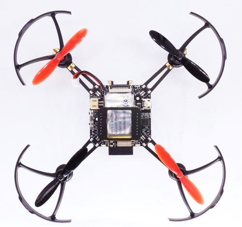
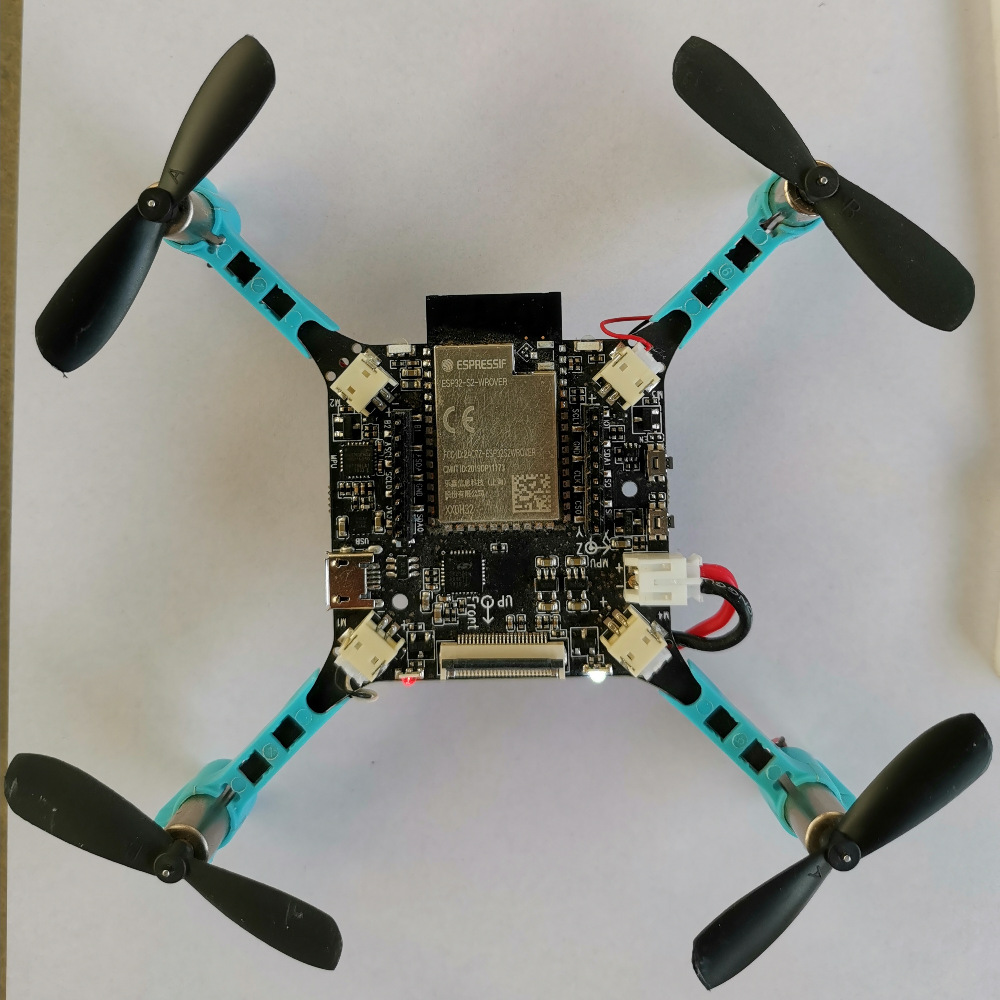
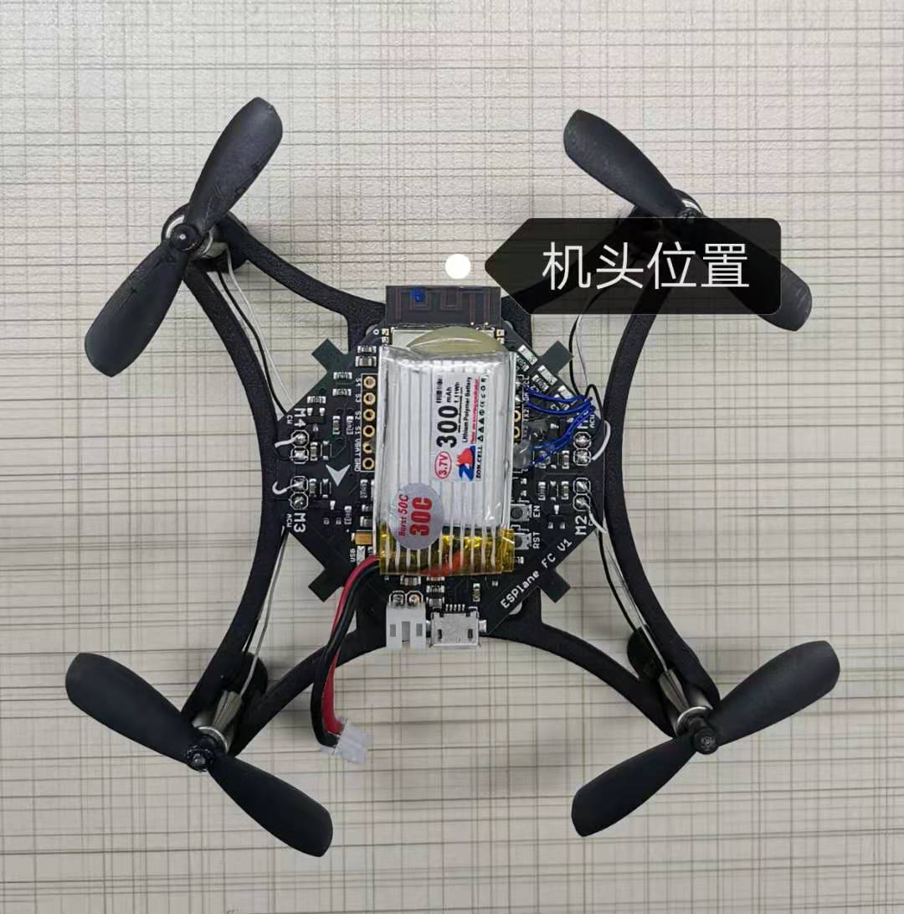

Hardware Reference
=======================

Supported Hardware 
----------------------

Supported Hardware List
~~~~~~~~~~~~~~~~~~~~~~~~~~~~~~

==================== ========================= =============================================
Development Board    Main Components             Notes
==================== ========================= =============================================
ESP32-S2-Drone V1.2  ESP32-S2-WROVER + MPU6050  All in one
ESPlane-V2-S2        ESP32-S2-WROVER + MPU6050  Four feet should be installed
ESPlane-FC-V1        ESP32-WROOM-32D + MPU6050  A drone frame should be installed
==================== ========================= =============================================

Configure Target Hardware
~~~~~~~~~~~~~~~~~~~~~~~~~~~~

-  Code in ``esp_drone`` repository supports a wide variety of hardware, which can be changed through ``menuconfig``.

   .. figure:: ../../_static/board_choose.png
      :alt: ESP-Drone config

      ESP-Drone config

-  By default, when set \ ``set-target`` as ``esp32s2``\, target hardware will be changed to ``ESP32_S2_Drone_V1_2``\  automatically.

-  By default, when set \ ``set-target`` as ``esp32``, target hardware will be changed to ``ESPlane_FC_V1``\  automatically.

**Notes**

1. ESPlane-FC-V1 is an old version hardware.

2. To use ESP-Drone new version code on ESPlane-FC-V1, please connect GPIO14 of ESP32-WROOM-32D to INT pin of MPU6050 by a jumper.

3. To avoid flash voltage switching triggered by IO12 when ESPlane-FC-V1 is powered on, please fix the flash voltage to 3.3 V by running ``espefuse.py`` script

   ``espefuse.py --port /dev/ttyUSB0 set_flash_voltage 3.3V``

   ``note * Only the first device attaching to the bus can use CS0 pin.``

ESP32-S2-Drone V1.2
-----------------------

   ESP-Drone

Main Board Schematic：\ `SCH_Mainboard_ESP32_S2_Drone_V1_2 <./_static/ESP32_S2_Drone_V1_2/SCH_Mainboard_ESP32_S2_Drone_V1_2.pdf>`__

Main Board PCB：\ `PCB_Mainboard_ESP32_S2_Drone_V1_2 <./_static/ESP32_S2_Drone_V1_2/PCB_Mainboard_ESP32_S2_Drone_V1_2.pdf>`__

Basic Component
~~~~~~~~~~~~~~~~~~~~~~~~~~

Basic Component List
^^^^^^^^^^^^^^^^^^^^^^^^^^^^^^

.. figure:: ../../_static/espdrone_s2_v1_2_hardware_package.png
   :alt: ESP-Drone

   ESP-Drone

================================== ======== =====================================
Basic Component List                Number      Notes
================================== ======== =====================================
Main board                          1        ESP32-S2-WROVER + MPU6050
716 motor                           4        Optional:  720 motor
716 motor rubber ring               4    
46mm propeller A                    2        Optional: 55mm propeller
46mm propeller B                    2    
300mAh 1s LiPo battery              1        Optional:  350mAh 
1s LiPo battery charging panel      1    
8-pin 25 mm male pins               2    
================================== ======== =====================================

Notice: Set ``motor type`` as ``brushed 720 motor`` through ``menuconfig->ESPDrone Config->motors config`` if you use 720 motor.

Main Controller
^^^^^^^^^^^^^^^^^^^^^^^^

========= ================ =====================================
Chip        Module              Notes
========= ================ =====================================
ESP32-S2   ESP32-S2-WROVER     4 MB flash, 2 MB PSRAM in module
========= ================ =====================================

Sensor
^^^^^^^^^^

========== =========== ===================
Sensor     Interface      Notes
========== =========== ===================
MPU6050    I2C0         Main board Sensor
========== =========== ===================

LEDs
^^^^^^^^^^^^^^^^^^^^^^^^

=================== ===== =================
Status               LED   Action
=================== ===== =================
POWER_ON            WHITE Fully lit
SENSORS CALIBRATION BLUE  Blinking slowly
SYSTEM READY        BLUE  Blinking
UDP_RX              GREEN Blinking
LOW_POWER           RED   Fully lit
=================== ===== =================

Buttons
^^^^^^^^^^^^

======= ======= ==============
Buttons   IO     Function
======= ======= ==============
SW1     GPIO1   Boot, Normal
SW2     EN      Reset
======= ======= ==============

Definition of Main Board IO
^^^^^^^^^^^^^^^^^^^^^^^^^^^^^^^^^^^

========= ===========  ===================
Pins       Function     Notes
========= ===========  ===================
GPIO11    I2C0_SDA      Only for MPU6050
GPIO10    I2C0_SCL      Only for MPU6050
GPIO37    SPI_MISO      MISO
GPIO35    SPI_MOSI      MOSI
GPIO36    SPI_CLK       SCLK
GPIO34    SPI_CS0       CS0\*
GPIO40    I2C1_SDA      VL53L1X
GPIO41    I2C1_SCL      VL53L1X
GPIO12    interrupt     MPU6050 interrupt
GPIO39    BUZ_1         BUZZ+
GPIO38    BUZ_2         BUZZ-
GPIO8     LED_RED       LED_1
GPIO9     LED_GREEN     LED_2
GPIO7     LED_BLUE      LED_3
GPIO5     MOT_1     
GPIO6     MOT_2     
GPIO3     MOT_3     
GPIO4     MOT_4     
GPIO2     ADC_7_BAT     VBAT/2
GPIO1     EXT_IO1    
========= ===========  ===================

Camera Interface
^^^^^^^^^^^^^^^^^^^^

======= ============= 
Pins      Function    
======= ============= 
GPIO13   CAM_VSYNC 
GPIO14   CAM_HREF  
GPIO15   CAM_Y9    
GPIO16   CAM_XCLK  
GPIO17   CAM_Y8    
GPIO18   CAM_RESET 
GPIO19   CAM_Y7    
GPIO20   CAM_PCLK  
GPIO21   CAM_Y6    
GPIO33   CAM_Y2    
GPIO45   CAM_Y4    
GPIO46   CAM_Y3    
======= ============= 

Extension Components
~~~~~~~~~~~~~~~~~~~~~~

.. list-table:: 
   :widths: 16 15 18 15 15
   :header-rows: 1

   * - Extension Board 
     - Main Sensor
     - Function
     - Interfaces
     - Mount Location
   * - Position-hold module
     - PMW3901 + VL53L1X
     - Indoor position-hold flight
     - SPI + I2C
     - Mount at bottom, facing to the ground.
   * - Pressure module
     - MS5611 pressure module
     - Height-hold flight
     - I2C or MPU6050 slave
     - Mount at the top or at the bottom
   * - Compass module
     - HMC5883 compass
     - Advanced flight mode, such as head-free mode
     - I2C or MPU6050 slave
     - Mount at the top or at the bottom

Extension board schematics：to be released

Extension board  PCB：to be released

Definition of Extension Board IO 
^^^^^^^^^^^^^^^^^^^^^^^^^^^^^^^^^^^^^^^^^^

=========== ========== ============= =========== 
Left Pins      IO        Right pins      IO     
=========== ========== ============= =========== 
SPI_CS0      GPIO34       VDD_33        IO     
SPI_MOSI     GPIO35       I2C0_SDA     GPIO11 
SPI_CLK      GPIO36       I2C0_SCL     GPIO10 
SPI_MISO     GPIO37       GND             
GND                       AUX_SCL         
I2C1_SDA     GPIO40       AUX_SDA         
I2C1_SCL     GPIO41       BUZ_2        GPIO38 
EXT_IO1      GPIO1        BUZ_1        GPIO39 
=========== ========== ============= ===========

ESPlane-V2-S2
-------------

   esplane_fc_v1

Main Board Schematic：\ `SCH_ESPlane_V2_S2 <./_static/ESPlane_V2_S2/SCH_ESPlane_V2_S2.pdf>`__

Main Board PCB：\ `PCB_ESPlane_V2_S2 <./_static/ESPlane_V2_S2/PCB_ESPlane_V2_S2.pdf>`__

ESPlane-FC-V1
------------------

   esplane_fc_v1

Main Board Schematic：\ `Schematic_ESPlane_FC_V1 <./_static/ESPlane_FC_V1/Schematic_ESPlane_FC_V1.pdf>`__

Main Board PCB：\ `PCB_ESPlane_FC_V1 <./_static/ESPlane_FC_V1/PCB_ESPlane_FC_V1.pdf>`__

.. _Basic_Component-1:

Basic Component
~~~~~~~~~~~~~~~~~~~~~~~~

.. _Basic_Component_List-1:

Basic Component List
^^^^^^^^^^^^^^^^^^^^^^^^^^^^^^^^^^

=============================== ============ ==============================
Basic Component List              Number        Notes
=============================== ============ ==============================
Main board                         1           ESP32-WROOM-32D + MPU6050
Drone frame                        1    
46 mm propeller A                  2    
46 mm propeller B                  2    
300 mAh 1s LiPo battery            1    
1s LiPo battery charging panel     1    
=============================== ============ ==============================

.. _Sensor-1:

Sensor
^^^^^^^^^^

======== =========== ========
Sensor    Interface    Notes
======== =========== ========
MPU6050   I2C0         Must
======== =========== ========

.. _LED-1:

LEDs
^^^^^^^^^^^^^^^^^^^^^^^^

::

   #define LINK_LED         LED_BLUE
   //#define CHG_LED        LED_RED
   #define LOWBAT_LED       LED_RED
   //#define LINK_DOWN_LED  LED_BLUE
   #define SYS_LED          LED_GREEN 
   #define ERR_LED1         LED_RED
   #define ERR_LED2         LED_RED

============= ======= ============
Status         LED     Action
============= ======= ============
SENSORS READY  BLUE    Fully lit
SYSTEM READY   BLUE    Fully lit
UDP_RX         GREEN   Blinking
============= ======= ============

.. _Main_Board_io_definition-1:

Definition of Main Board IO
^^^^^^^^^^^^^^^^^^^^^^^^^^^^^^^^^^^^

======= ============== ============================
Pins     Function         Notes
======= ============== ============================
GPIO21   SDA           I2C0 data
GPIO22   SCL           I2C0 clock
GPIO14   SRV_2         MPU6050 interrupt
GPIO16   RX2       
GPIO17   TX2       
GPIO27   SRV_3         BUZZ+
GPIO26   SRV_4         BUZZ-
GPIO23   LED_RED       LED_1
GPIO5    LED_GREEN     LED_2
GPIO18   LED_BLUE      LED_3
GPIO4    MOT_1     
GPIO33   MOT_2     
GPIO32   MOT_3     
GPIO25   MOT_4     
TXD0             
RXD0             
GPIO35   ADC_7_BAT      VBAT/2
======= ============== ============================

.. _Components_of_extension_board-1:

Componets of Extension Board
~~~~~~~~~~~~~~~~~~~~~~~~~~~~~~~~~~~~~~~~

ESPlane + PMW3901 Pins Allocation
^^^^^^^^^^^^^^^^^^^^^^^^^^^^^^^^^^^^^^^

====== ========== =============================
Pins    Function       Notes
====== ========== =============================
GPIO21 SDA          I2C0 data
GPIO22 SCL          I2C0 clock
GPIO12 MISO/SRV_1   HSPI
GPIO13 MOSI         HSPI
GPIO14 SCLK/SRV_2   HSPI 
GPIO15 CS0\*        HSPI
GPIO16 RX2        
GPIO17 TX2        
GPIO19 interrupt    MPU6050 interrupt
GPIO27 SRV_3        BUZZ+
GPIO26 SRV_4        BUZZ-
GPIO23 LED_RED      LED_1
GPIO5  LED_GREEN    LED_2
GPIO18 LED_BLUE     LED_3
GPIO4  MOT_1      
GPIO33 MOT_2      
GPIO32 MOT_3      
GPIO25 MOT_4      
TXD0              
RXD0              
GPIO35 ADC_7_BAT    VBAT/2
====== ========== =============================
