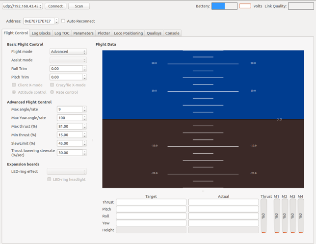

# 通信协议

## 通信层级结构

||||
|:--:|:--:|:--:|
|终端|手机/PC|ESP-Drone|
|应用层|APP | 飞控固件|
|协议层|CRTP |CRTP |
|传输层|UDP|UDP|
|物理层|Wi-Fi STA (Station)|Wi-Fi AP (Access Point)|

## Wi-Fi 通信

### ESP32/ESP32-S2 Wi-Fi 性能

 **ESP32 Wi-Fi 性能**

| 项目 | 参数 |
|--|--|
| 模式 | STA 模式、AP 模式、共存模式 |
| 协议 | IEEE 802.11b、IEEE 802.11g、IEEE 802.11n、802.11 LR（乐鑫）支持软件切换 |
| 安全性 |WPA、WPA2、WPA2-Enterprise、WPS |
| 主要特性 |AMPDU、HT40、QoS |
| 支持距离 |乐鑫专属协议下 1 km|
| 传输速率 |20 Mbit/s TCP 吞吐量、30 Mbit/s UDP |

其它参数见 [ESP32 Wi-Fi 特性列表](https://docs.espressif.com/projects/esp-idf/en/latest/esp32/api-guides/wifi.html#esp32-wi-fi-feature-list)。

 **ESP32-S2 Wi-Fi 性能**

| 项目 | 参数 |
|--|--|
| 模式 | STA 模式、AP 模式、共存模式 |
| 协议 | IEEE 802.11b、IEEE 802.11g、IEEE 802.11n 支持软件切换 |
| 安全性 |WPA、WPA2、WPA2-Enterprise、WPS |
| 主要特性 |AMPDU、HT40、QoS |
| 支持距离 |乐鑫专属协议下 1 km|
| 传输速率 |20 Mbit/s TCP 吞吐量、30 Mbit/s UDP |

其他参数见 [ESP32-S2 Wi-Fi 特性列表](https://docs.espressif.com/projects/esp-idf/en/latest/esp32s2/api-guides/wifi.html#esp32-s2-wi-fi-feature-list)。

### Wi-Fi 编程框架

**基于 ESP-IDF 的 Wi-Fi 编程框架：**


**一般使用过程如下：**

1. 应用层调用 [Wi-Fi 驱动 API](https://docs.espressif.com/projects/esp-idf/en/latest/esp32/api-reference/network/esp_wifi.html)，进行 Wi-Fi 初始化。
2. Wi-Fi 驱动对开发人员透明。事件发生，则 Wi-Fi 驱动向默认事件循环：[default event loop](https://docs.espressif.com/projects/esp-idf/en/latest/esp32/api-reference/system/esp_event.html#esp-event-default-loops)
发布 `event`。应用程序可根据需求编写 `handle` 程序，进行注册。
3. 网络接口组件 [esp_netif](https://docs.espressif.com/projects/esp-idf/en/latest/esp32/api-reference/network/esp_netif.html) 提供了一系列 `handle` 程序，与 Wi-Fi 驱动 `event` 默认关联。例如 ESP32 作为 AP，当有用户接入时，esp_netif 将自动启动 DHCP 服务。
 
具体的使用过程，可查阅代码 `\components\drivers\general\wifi\wifi_esp32.c`。

注意：Wi-Fi 初始化之前应使用 `WIFI_INIT_CONFIG_DEFAULT` 获取初始化配置结构体，对该结构体进行个性化配置，然后进行初始化工作。请注意防范结构体成员未初始化导致的问题，在 ESP-IDF 更新添加了新的结构体成员时，应尤其特别注意这一问题。

**AP 模式工作状态图:**


### 提高 Wi-Fi 通信距离

依次进入：`Component config>>PHY>>Max WiFi TX power (dBm)`，将 `Max WiFi TX power` 改为 `20`。该项配置将提高 PHY 增益，提高 Wi-Fi 通信距离。

## UDP 通信

### UDP 端口号

| App |方向 | ESP-Drone |
|--|--|--|
| 192.168.43.42::2399 | TX/RX | 192.168.43.42::2390 | 

### UDP 包结构

```text
/* Frame format:
 * +=============+-----+-----+
 * | CRTP                      |   CKSUM   |
 * +=============+-----+-----+
 */
UDP 传输的数据包为：CRTP + 校验信息。
CRTP：按照 CRTP 包结构定义，包含 Header + Data，具体参考 CRTP 协议部分。
CKSUM：为校验信息，大小为 1 byte，将 CRTP 包按照 byte 累加即可。
```

**CKSUM 计算方法：**

```python
#python为例：计算 raw 的 cksum，并将其添加到包尾
 raw = (pk.header,) + pk.datat
 cksum = 0
 for i in raw:
		cksum += i
 cksum %= 256
 raw = raw + (cksum,)
```

## CRTP 协议

ESP-Drone 项目继承 Crazyflie 项目使用的 CRTP 协议，用于飞行指令发送、飞行数据回传、参数设置等。

CRTP 实现了无状态设计，不需要握手步骤。任何命令均可在任意时刻发送，但对于一些 log/param/mem 命令，需下载 TOC \(目录\)，协助主机正确发送信息。已经实现的 Python API (cflib) 实现下载 param/log/mem TOC，确保能够使用所有功能。

### CRTP 包结构

> CRTP 包大小为 32 字节，其中包含一个字节的 Header，31 个字节的 Payload。Header 记录端口（4 位）、通道（2 位）、及保留位（2 位）。

```text
  7   6   5   4   3   2   1   0
+---+---+---+---+---+---+---+---+
|     Port      |  Res. | Chan. | 
+---+---+---+---+---+---+---+---+
|            DATA 0             |
+---+---+---+---+---+---+---+---+
:   :   :   :   :   :   :   :   :
+---+---+---+---+---+---+---+---+
|            DATA 30            |
+---+---+---+---+---+---+---+---+
```

| 字段 | 字节 | 位 | 描述 |
| :---: | :---: | :---: | :---: |
| Header | 0 | 0 ~ 1 | 目标数据通道 |
|  | 0 | 2 ~ 3 | 保留，用于传输层 |
|  | 0 | 4 ~ 7 | 目标数据端口 |
| Data | 1 ~ 31 | 数据包中的数据 |  |

### 端口分配

| 端口号 | 数据端口 | 用途 |
| :---: | :---: | :---: |
| 0 | Console | Console 使用 consoleprintf 函数将调试信息输出到 PC 端。 |
| 2 | Parameters | 读写 Crazyflie 参数。参数可在源码中用宏表示。|
| 3 | Commander | 发送 roll/pitch/yaw/thrust 控制指令。 |
| 4 | Memory access | 访问非易失性存储，如 1 线访问和 I2C 访问。仅支持 Crazyflie 2.0 |
| 5 | Log | 设置日志变量。日志变量将定期发送至 Crazyflie，日志变量在 Crazyflie 源码中用宏表示。|
| 6 | Localization | 本地化相关包 |
| 7 | Generic Setpoint | 运行发送定位点和控制模式 |
| 13 | Platform | 用于 misc platform 控制，如调试和掉电等 |
| 14 | Client-side debugging | 用于调试 PC 端 UI 界面程序，值针对 Crazyflie Python API。|
| 15 | Link layer | 用于控制和访问通信链路层。 |

固件中大部分连接到端口的模块，以任务的方式实现。如果有传入的 CRTP 包在信息传递队列中传递，则任务在队列中阻塞。启动时，每个任务及其它模块需要在通信链路层为预定义的端口注册。

* 各个端口使用详情可参考：[CRTP - 与 Crazyflie 通信](https://www.bitcraze.io/documentation/repository/crazyflie-firmware/master/functional-areas/crtp/)。


### CRTP 协议支持包

* **cflib 是 CRTP 协议的 Python 支持包，提供了通信协议的应用层接口，可用于构建上位机。** 
* 固件中每一个使用 CRTP 协议的组件，在 cflib 中都有一个脚本与其对应。

cflib 是用 Python 编写的 API，用于与 Crazyflie 和 Crazyflie 2.0 四轴飞行器通信。目的是用客户端软件与 Crazyflie 四轴飞行器通信，并控制飞行器。例如 cfclient Crazyflie PC 客户端即可使用 cflib。

* 源工程仓库地址：[crazyflie-lib-python](https://github.com/bitcraze/crazyflie-lib-python)。

* 适配 ESP-Drone 的 cflib 工程仓库地址：[qljz1993/crazyflie-lib-python](https://github.com/qljz1993/crazyflie-lib-python.git)。需要切换到 `esplane` 分支。

## 基于 CRTP 协议的应用开发

### 各个平台工程模板

1. [crazyflie2-ios-client](https://github.com/bitcraze/crazyflie2-ios-client)

2. [crazyflie2-windows-uap-client](https://github.com/bitcraze/crazyflie2-windows-uap-client)

3. [crazyflie-android-client](https://github.com/bitcraze/crazyflie-android-client)
4. [安卓版本使用指南](https://wiki.bitcraze.io/doc:crazyflie:client:cfandroid:index)
5. [安卓版本开发指南](https://wiki.bitcraze.io/doc:crazyflie:dev:env:android)

### cfclient

cfclient 是 `Crazeflie` 源工程的上位机，完全实现了 `CRTP` 协议中定义的功能，可以加快飞机的调试过程。ESP-Drone 项目对该上位机进行裁剪和调整，满足功能设计需求。



cfclient 具体使用说明可查阅：[cfclient](gettingstarted.html#pc-cfclient)。


