# 驱动程序

<!-- ## 通用驱动（待补充？？？如果现在没有的话，是不是可以先删除掉？？？） -->

<!-- * ADC -->

<!-- * 蜂鸣器 -->

<!-- * LED -->

<!-- * 马达 -->

<!-- * [Wi-Fi 驱动](./communication.md) -->

## I2C 设备驱动 (i2c_devices)

### MPU6050 传感器

#### MPU6050 传感器特性

**工作原理**

* 陀螺仪：当陀螺仪围绕任何感应轴旋转时，由于科里奥利效应，会产生振动。这种振动可以被电容式传感器检测到，传感器所得到的信号被放大，解调和滤波，产生与角速度成比例的电压。
* 电子加速度计：加速沿着一条特定轴在相应的检测质量上位移，则电容式传感器会检测到电容的变化。

**测量范围**

* 可配置陀螺仪测量范围：±250 °/sec、±500 °/sec、±1000 °/sec、±2000 °/sec
* 可配置加速度计测量范围：±2 g、±4 g、±8 g、±16 g

**AUX I2C 接口**

* MPU6050 具有一个辅助 I2C 总线，用于与片外 3-轴数字磁力计或其它传感器进行通信。
* AUX I2C 接口支持两种工作模式：I2C Master 模式或 Pass-Through 模式。

**MPU6050 FIFO**

* MPU6050 包含一个可通过串行接口访问的 1024 字节 FIFO 寄存器。FIFO 配置寄存器决定哪个数据写入 FIFO，包括：陀螺仪数据、加速计数据、温度读数、辅助传感器读数和 FSYNC 输入。

**数字低通滤波器 (DLPF)**

* MPU6050 自带低通滤波器，可通过配置寄存器 26 控制低通滤波频段，减少高频干扰，但会降低传感器输入速率。开启 DLPF 加速度计输出 1 kHz，关闭 DLPF 可以输出 8 kHz。

**FSYNC 帧同步采样管脚**

* 寄存器 26 EXT\_SYNC\_SET，用于配置外部帧同步管脚的采样。

**数字运动处理器 (DMP)**

* MPU6050 内部存在一个数字运动处理单元 (Digital Motion Processor, DMP)，可以计算四元数等，减轻主 CPU 压力。
* DMP 可通过管脚触发中断。

   

**MPU6050 方向定义**

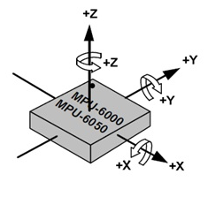

#### MPU6050 初始化步骤

1. 恢复寄存器默认值：设置 PWR\_MGMT\_1 bit7 为 1，恢复后 bit7 为 0，bit6 自动设置为 1，进入 sleep 模式；
2. 设置 PWR\_MGMT\_1 bit6 为 0，唤醒传感器；
3. 设置时钟源；
4. 设置量程：分别设置陀螺仪和加速度计量程；
5. 设置采样率；
6. 设置数字低通滤波器（可选）。

#### MPU6050 关键寄存器

**寄存器典型值**

| 寄存器 | 典型值 | 功能 |
| :---: | :---: | :---: |
| PWR\_MGMT\_1 | 0x00 | 正常启用 |
| SMPLRT\_DIV | 0x07 | 陀螺仪采样率 125 Hz |
| CONFIG | 0x06 | 低通滤波器频率为 5 Hz |
| GYRO\_CONFIG | 0x18 | 陀螺仪不自检，输出满量程范围为 ±2000 °/s |
| ACCEL\_CONFIG | 0x01 | 加速度计不自检，输出的满量程范围为 ±2 g |

**寄存器 117 WHO\_AM\_I - 设备地址**

* \[6:1\] 保存设备地址，默认为 0x68，不反映 AD0 管脚值。

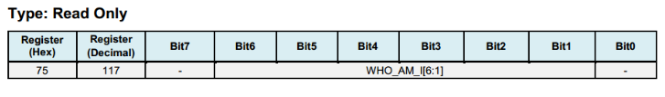

**寄存器 107 PWR\_MGMT\_1 - 电源管理 1**

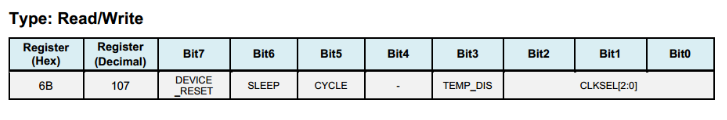

* DEVICE\_RESET：置位此位，则寄存器使用默认值。 
* SLEEP：置位此位，则 MPU6050 将置于睡眠模式。
* CYCLE：置位此位，且 SLEEP 设置为禁用时，MPU6050 将进入循环模式 (CYCLE)。在循环模式下，MPU6050 进入睡眠，达到 LP\_WAKE\_CTRL（寄存器 108）设定的时间后，从睡眠模式唤醒，完成一次对活动传感器的采样，然后再进入睡眠模式，依次循环。

**寄存器 26 CONFIG - 配置数字低通滤波器**

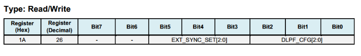

* 数字低通滤波器 (DLPF) 取值与滤波频段关系如下：

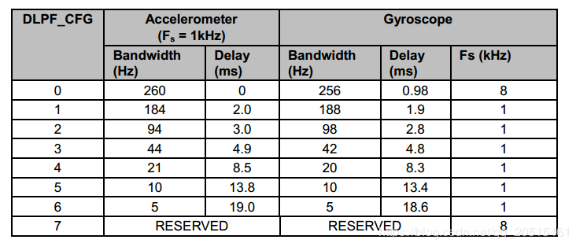

**寄存器 27 - GYRO\_CONFIG 陀螺仪量程配置**

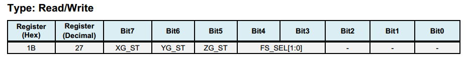

* XG\_ST：X 轴陀螺仪自检
* FS\_SEL：用于配置陀螺仪量程，具体信息见下表：

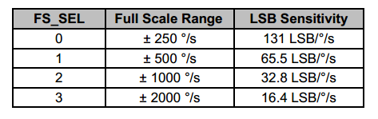

**寄存器 28 ACCEL\_CONFIG - 配置加速度计量程**

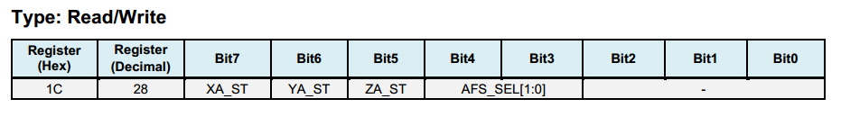

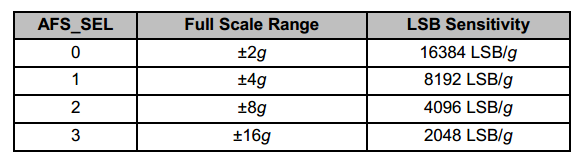

**寄存器 25 SMPRT\_DIV - 采样速率分频器**

该寄存器指定陀螺仪输出速率的分频器，用于为 MPU6050 生成采样速率。传感器寄存器的输出、FIFO 输出和 DMP 采样都是基于采样率。陀螺仪输出速率除以 (1 + SMPLRT\_DIV) 得到采样率，公式如下：

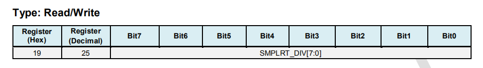

> Sample Rate = Gyroscope Output Rate / \(1 + SMPLRT\_DIV\) 

其中，当 DLPF 禁用时，即 DLPF\_CFG = 0 或 7 时，陀螺仪输出速率为 8 kHz；当 DLPE 使能时，见寄存器 26，陀螺仪输出速率为 1 kHz。注意，在不开启 DLPF 的情况下，设置 SMPLRT\_DIV 为 7 可以使芯片产生 1kHz 的中断信号。

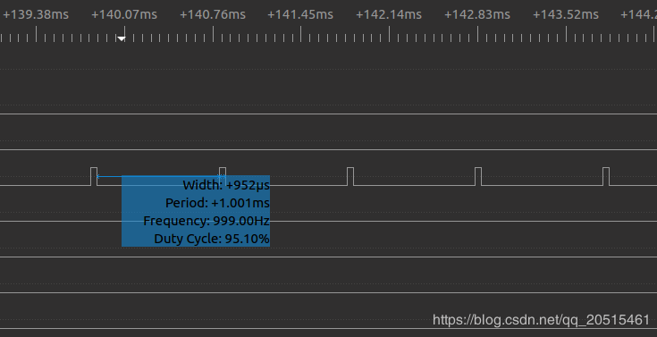

**寄存器 59 ~ 64 - 加速度计测量值**


* 大端序存放：地址低位存放数据高位，地址高位存放数据低位。 
* 补码存放：测量值为有符号整数，因此采用补码方式存放。

**寄存器 65 ~ 66 - 温度测量**

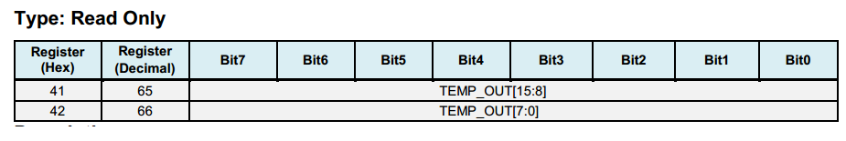

**寄存器 67 ~ 72 - 陀螺仪测量值**

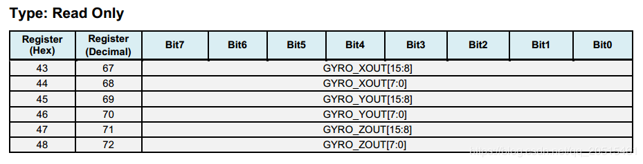

### VL53LXX 传感器

#### VL53LXX 传感器特性

**工作原理**

VL53L0X/VL53L1X 芯片内部集成了激光发射器和 SPAD 红外接收器。芯片通过探测光子发送和接收时间差，计算光子飞行距离，最远测量距离可达两米，适合中短距离测量的应用。

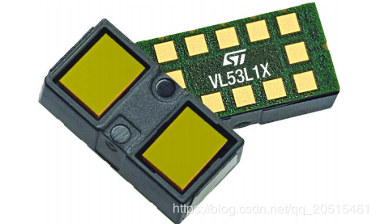
 
**测量区域 - ROI**

VL53L0X/VL53L1X 的测量值为测量区域中的最短距离，测量区域可以根据使用场景进行放大或缩小，较大的探测范围可能会引起测量值的波动。

测量区域的配置参见 [VL53LXX Datasheet](https://www.st.com/resource/en/datasheet/vl53l1x.pdf) 中 2.4 Ranging Description 和 2.8 Sensing Array Optical Center。

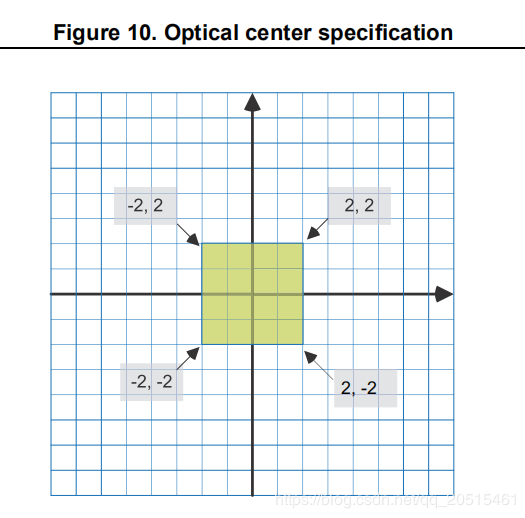

**测量距离**

* VL53L0X 传感器存在 **3 ~ 4 cm 的盲区**，有效测量范围为 3 ~ 200 cm，精度 ±3%。
* VL53L1X 是 VL53L0X 的升级版本，探测距离可达 400 cm。

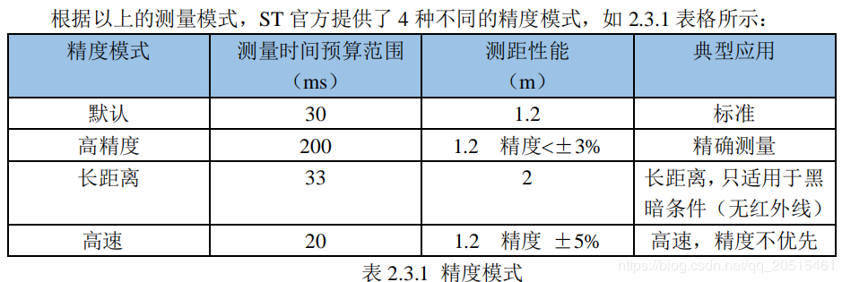

* VL53LXX 测量距离与光线环境有关，黑暗环境下探测距离更远；在室外强光下，激光传感器可能会受到很大的干扰，导致测量精度降低，因此室外需要结合气压定高。

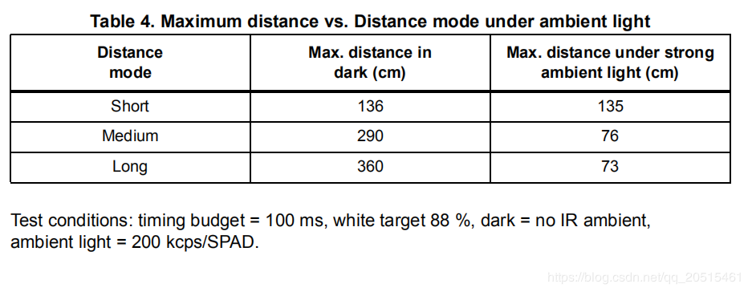

**测量频率**

* VL53L0X 响应频率最快可达 50 Hz，测量误差 ±5%。
* VL53L1X I2C 最高时钟频率可达 400 kHz，上拉电阻需要根据电压和总线电容值选择。具体信息请参考 [VL53LXX Datasheet](https://www.st.com/resource/en/datasheet/vl53l1x.pdf)。

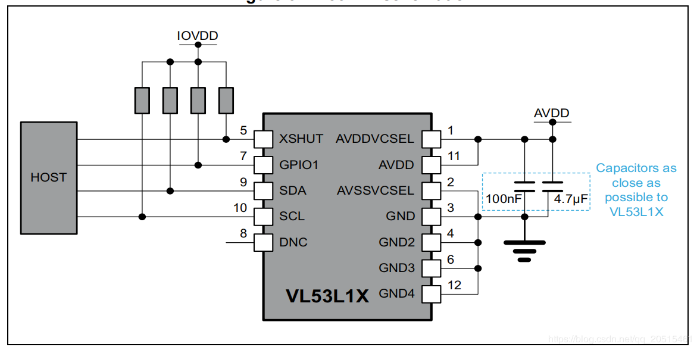

* XSHUT 为输入管脚，用于模式选择（休眠），需要上拉电阻防止漏电流。
* GPIO1 为中断输出管脚，用于输出测量 dataready 中断。

**工作模式**

通过设置 XSHUT 管脚的电平，可以切换传感器进入 HW Standby 模式或 SW Standby 模式，实现有条件启动，降低待机功耗。如果主机放弃管理传感器模式，可将 XSHUT 管脚默认设置为上拉。

* HW Standby：XSHUT 拉低，传感器电源关闭。
* SW Standby：XSHUT 拉高，进入 boot 和 SW Standby 模式。

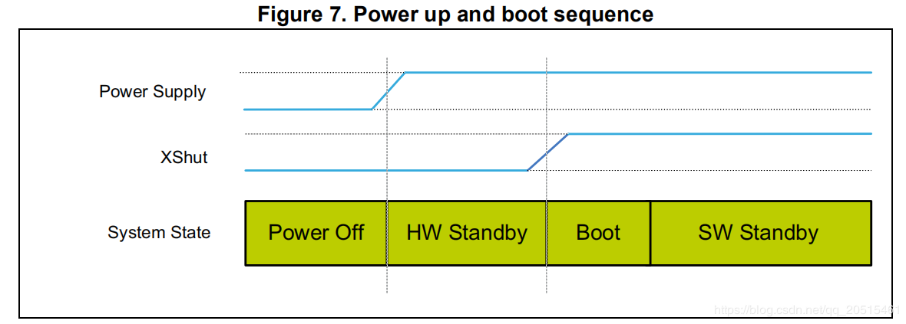

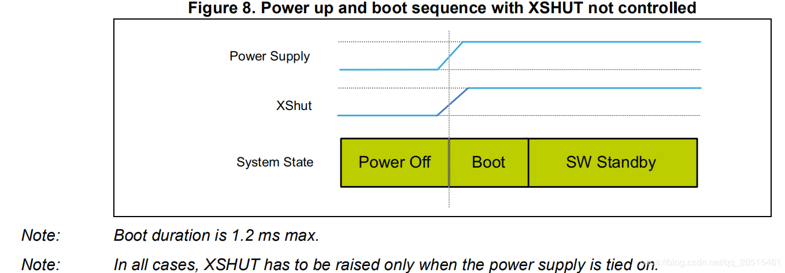

#### VL53LXX 初始化步骤

1. 等待硬件初始化完成；
2. 数据初始化；
3. 静态初始化，装载数据；
4. 设置测量距离模式；
5. 设置单次测量最长等待时间；
6. 设置测量频率（时间间隔）；
7. 设置测量区域 ROI（可选）；
8. 启动测量。

```text
/*init  vl53l1 module*/
void vl53l1_init()
{

    Roi0.TopLeftX = 0;    //测量目标区（可选）最小 4*4，最大 16*16。
    Roi0.TopLeftY = 15;
    Roi0.BotRightX = 7;
    Roi0.BotRightY = 0;
    Roi1.TopLeftX = 8;
    Roi1.TopLeftY = 15;
    Roi1.BotRightX = 15;
    Roi1.BotRightY = 0;

    int status = VL53L1_WaitDeviceBooted(Dev); //等待硬件初始化完成。
    status = VL53L1_DataInit(Dev); //数据初始化，上电后立刻执行。
    status = VL53L1_StaticInit(Dev); //静态初始化，装载参数。
    status = VL53L1_SetDistanceMode(Dev, VL53L1_DISTANCEMODE_LONG);//设置测量模式。
    status = VL53L1_SetMeasurementTimingBudgetMicroSeconds(Dev, 50000); //根据测量模式确定最长等待时间。
    status = VL53L1_SetInterMeasurementPeriodMilliSeconds(Dev, 100); //设置测量间隔。

    status = VL53L1_SetUserROI(Dev, &Roi0); //设置测量区域 ROI
    status = VL53L1_StartMeasurement(Dev); //启动测量
    if(status) {
        printf("VL53L1_StartMeasurement failed \n");
        while(1);
    }    

}
```

注意，上述初始化步骤除 VL53L1\_SetUserROI 外，其余步骤不可缺少。

#### VL53LXX 测距步骤

**轮询测量模式**

轮询测量流程图：

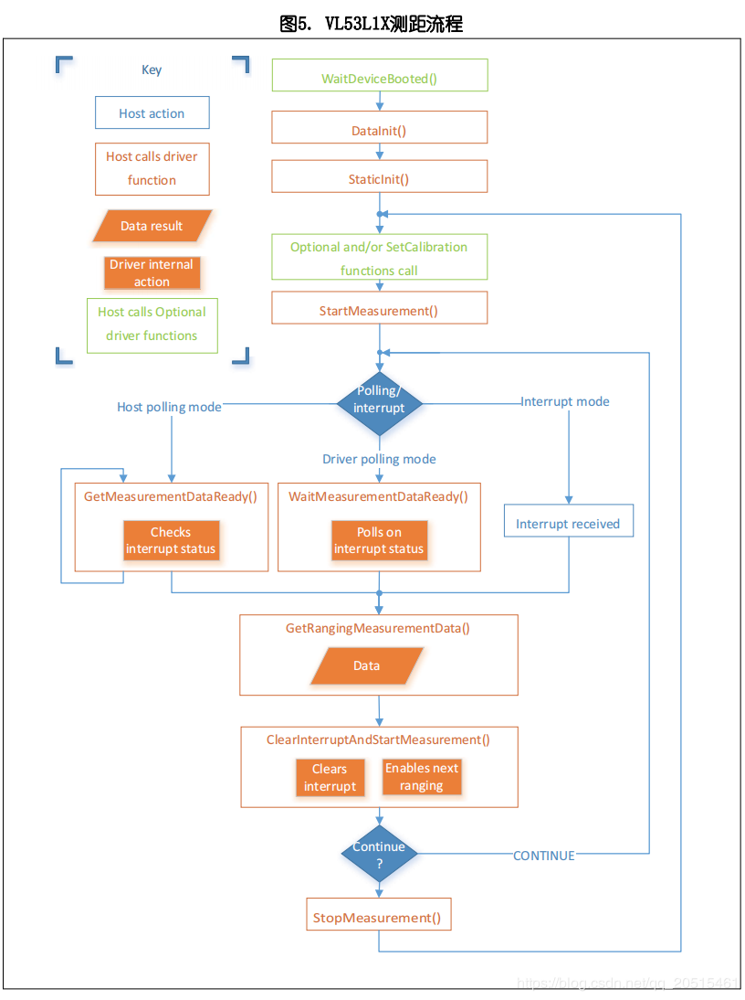

* 注意，完成一次测量和读取后，需要使用 `VL53L1_ClearInterruptAndStartMeasurement` 清除中断标志并重新开始。
* 轮询测量有两种方法，如上图所示：一种是阻塞方式 (Drivers polling mode)；一种是非阻塞方式 (Host polling mode)。以下代码为阻塞测量方式：

```text
/* Autonomous ranging loop*/
static void
AutonomousLowPowerRangingTest(void)
{
    printf("Autonomous Ranging Test\n");

    static VL53L1_RangingMeasurementData_t RangingData;
    VL53L1_UserRoi_t Roi1;
    int roi = 0;
    float left = 0, right = 0;
    if (0/*isInterrupt*/) {
    } else {
        do // polling mode
            {
                int status = VL53L1_WaitMeasurementDataReady(Dev); //等待测量结果
                if(!status) {
                    status = VL53L1_GetRangingMeasurementData(Dev, &RangingData); //获取单次测量数据
                    if(status==0) {
                        if (roi & 1) {
                            left = RangingData.RangeMilliMeter;
                            printf("L %3.1f R %3.1f\n", right/10.0, left/10.0);
                        } else
                            right = RangingData.RangeMilliMeter;
                    }
                    if (++roi & 1) {
                        status = VL53L1_SetUserROI(Dev, &Roi1);
                    } else {
                        status = VL53L1_SetUserROI(Dev, &Roi0);
                    }
                    status = VL53L1_ClearInterruptAndStartMeasurement(Dev); //释放中断
                }
            }
        while (1);
    }
    //  return status;
}
```

**中断测量模式**

中断测量模式需要使用中断管脚 GPIO1，在数据 ready 时，GPIO1 管脚电平将被拉低，通知主机读取数据。

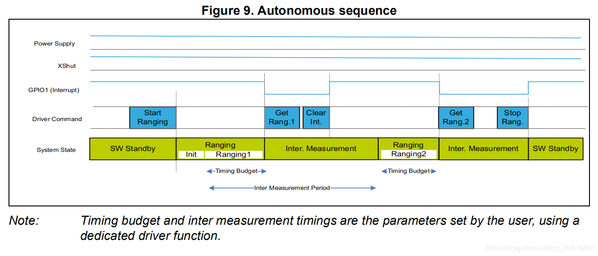

#### VL53LXX 传感器校准

如果传感器接收器上方安装了光罩，或传感器安装在透明盖板背后，由于透光率的变化，需要对传感器进行校准。您可以根据校准流程调用 API 编写校准程序，也可以使用官方提供的 GUI 上位机直接测量出校准值。

**使用官方 API 编写校准程序**

校准流程：调用顺序要完全一致。

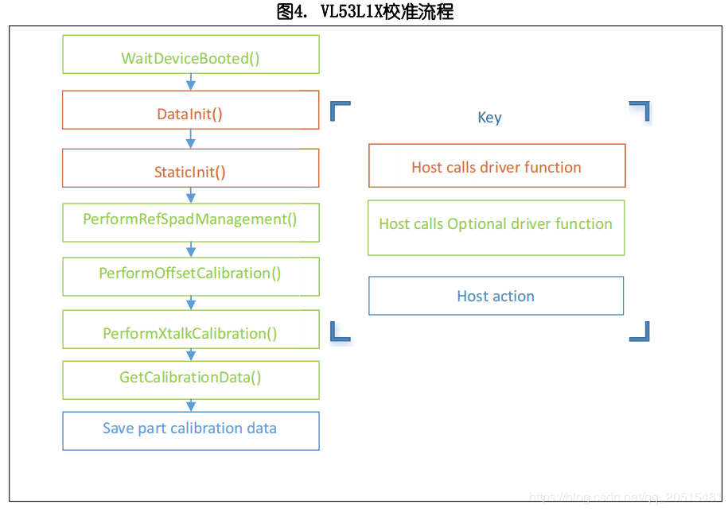

```
/*VL53L1 模块校准*/
static VL53L1_CalibrationData_t vl53l1_calibration(VL53L1_Dev_t *dev)
{
    int status;
    int32_t targetDistanceMilliMeter = 703;
    VL53L1_CalibrationData_t calibrationData;
    status = VL53L1_WaitDeviceBooted(dev);
    status = VL53L1_DataInit(dev);                                       //设备初始化
    status = VL53L1_StaticInit(dev);                                     // 为给定用例，加载设备设置。
    status = VL53L1_SetPresetMode(dev,VL53L1_PRESETMODE_AUTONOMOUS);
    status = VL53L1_PerformRefSpadManagement(dev);
    status = VL53L1_PerformOffsetCalibration(dev,targetDistanceMilliMeter);
    status = VL53L1_PerformSingleTargetXTalkCalibration(dev,targetDistanceMilliMeter);
    status = VL53L1_GetCalibrationData(dev,&calibrationData);

    if (status)
    {
        ESP_LOGE(TAG, "vl53l1_calibration failed \n");
        calibrationData.struct_version = 0;
        return calibrationData;

    }else
    {
        ESP_LOGI(TAG, "vl53l1_calibration done ! version = %u \n",calibrationData.struct_version);
        return calibrationData;
    }

}
```

**使用官方 GUI 上位机校准传感器**

官方提供了用于配置和校准传感器的 GUI 上位机，配合 ST 官方 `STM32F401RE nucleo` 开发板连接传感器，使用软件校准得到基准值后，初始化时填入即可。

>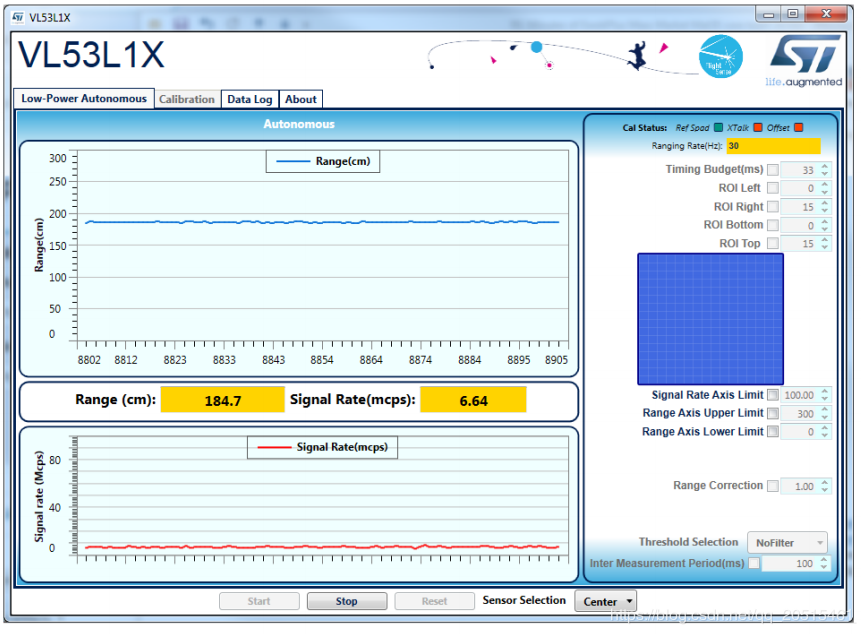

>更多信息，可参考 [STSW-IMG008: Windows Graphical User Interface \(GUI\) for VL53L1X Nucleo packs. Works with P-NUCLEO-53L1A1](https://www.st.com/content/st_com/en/products/embedded-software/proximity-sensors-software/stsw-img008.html)。

#### VL53L1X 例程

**例程说明**

1. 实现功能：通过 VL53L1X 检测到高度变化（持续 1 秒），红灯亮起。高度恢复正常值（持续 1 秒），绿灯亮起。
2. 可配置参数：通过 `make menuconfig` 设置 I2C 号码、端口号、LED 端口号。
3. 例程解析见代码注释和用户手册。

**注意事项**

4. 该例程只适用于 VL53L1X，VL53L0X 为老版本硬件，不适用本例程。
5. 官方标称 400 cm 测量距离，为黑暗环境下测得。室内正常灯光环境，可以保证 10 ~ 260 cm 范围的有效测量。
6. 初始化函数 `vl53l1\_init (VL53L1\_Dev\_t \*)` 中部分参数，需要根据实际使用环境确定，还有优化的空间。
7. 传感器安装位置应确保在检测位置正上方。
8. 模块上电时自动矫正基准高度，如果基准高度有变化，需要重新上电重置参数。

**例程仓库**

点击 [esp32-vl53l1x-test](https://github.com/qljz1993/esp32-vl53l1x-test/tree/master) 查看例程，或使用 git 工具下载例程：

```text
git clone https://github.com/qljz1993/esp32-vl53l1x-test.git
```

<!-- ### MS5611 -->

<!-- ### HMC5883L -->

<!-- ### EEPROM -->

## SPI 设备驱动 (spi_devices)

### PMW3901 传感器

#### PMW3901 传感器特性

PMW3901 是 PixArt 公司最新的高精度低功耗光学追踪模组，可直接获取 X-Y 方向运动速度信息，实现对地高度 8 cm 以上进行有效测量。PWM3901 工作电流小于 9 mA，工作电压为 VDD (1.8 ~ 2.1 V)，VDDIO (1.8 ~ 3.6 V)，使用 4 线 SPI 接口通信。

**主要参数** 

| 参数 | 参数值 |
|--|--|
|供电电压 (V) | VDD：1.8 ~ 2.1 V；VDDIO：1.8 ~ 3.6 V|
|工作范围 (mm) | 80 ~ +∞|
| 接口 |  4 线 SPI @ 2 MHz|
| 封装 |  28 管脚 COB 封装，尺寸：6 x 6 x 2.28 mm |

**封装和管脚图**

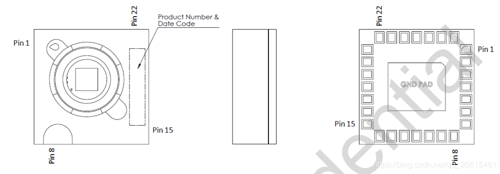

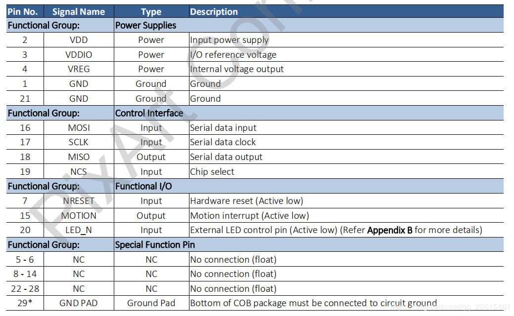

>传感器工作电压较低，与 3.3 V 的 ESP32 通信，需要 VDD 和 VDDIO 提供不同的电压。

#### 上电启动流程

**上电流程** 

PMW3901MB 虽然可执行内部上电自复位，但仍建议每次上电时，对 Power_Up_Reset 寄存器执行写操作。具体顺序如下:

1. 首先对 VDDIO 供电，然后对 VDD 供电，中间延迟不应超过 100 ms。注意确保供电稳定。
2. 等待至少 40 ms。 
3. 先拉高，然后再拉低 NCS，以复位 SPI 口。 
4. 写 0x5A 到 Power_Up_Reset 寄存器，或切换至 NRESET 管脚。 
5. 等待至少 1 ms。 
6. 无论运动管脚状态如何，一次读取寄存器 0x02、0x03、0x04、0x05 和 0x06。
7. 请参考 PWM3901MB Datasheet 章节 8.2 性能优化寄存器来配置所需的寄存器，以实现芯片的最佳性能。

**掉电流程** 

通过写 Shutdown 寄存器，可将 PMW3901MB 设置为 Shutdown 模式。Shutdown 模式下 PMW3901MB 只对上电启动指令（写 0x5A 到寄存器 0x3A）进行响应，不响应其它访问操作。同一 SPI 总线下的其它设备不受 PMW3901MB Shutdown 模式的影响，在 NCS 管脚不冲突的情况下可以正常访问。

从 Shutdown 模式复位：

1. 拉高，然后再拉低 NCS，以复位 SPI 口；
2. 写 0x5A 到 Power_Up_Reset 寄存器，或切换至 NRESET 管脚；
3. 等待至少 1 ms；
4. 无论运动管脚状态如何，一次性读取寄存器 0x02、0x03、0x04、0x05 和 0x06； 
5. 请参考 PWM3901MB Datasheet 章节 8.2 性能优化寄存器来配置所需的寄存器，以实现芯片的最佳性能。

[PixArt 其它产品助力 IoT](https://www.pixart.com/applications/11/Connected_Home_Appliances_%EF%BC%86_IoT)

#### 部分代码解读

**关键结构体**

```

typedef struct opFlow_s 
{
	float pixSum[2]; /*累积像素*/
	float pixComp[2]; /*像素补偿*/
	float pixValid[2]; /*有效像素*/
	float pixValidLast[2]; /*上一次有效像素*/
	float deltaPos[2]; /*2 帧之间的位移 单位：cm*/
	float deltaVel[2]; /*速度 单位 cm/s*/
	float posSum[2]; /*累积位移 单位 cm*/
	float velLpf[2]; /*速度低通 单位 cm/s*/
	bool isOpFlowOk; /*光流状态*/
	bool isDataValid; /*数据有效*/
} opFlow_t;

```

* 累积像素：飞行器起飞后的累积像素；
* 像素补偿：补偿由于飞行器倾斜导致的像素误差；
* 有效像素：指经过补偿的实际像素；
* 2 帧之间的位移：即由像素转换出来的实际位移，单位 cm；
* 速度：表示瞬时速度，由位移变化量微分得到，单位 cm/s；
* 累积位移：实际位移，单位 cm；
* 速度低通：对速度进行低通，增加数据平滑性；
* 光流状态：检查光流是否正常工作；
* 数据有效：在一定高度范围内，数据有效。

```
typedef struct motionBurst_s {
  union {
    uint8_t motion;
    struct {
      uint8_t frameFrom0    : 1;
      uint8_t runMode       : 2;
      uint8_t reserved1     : 1;
      uint8_t rawFrom0      : 1;
      uint8_t reserved2     : 2;
      uint8_t motionOccured : 1;
    };
  };

  uint8_t observation;
  int16_t deltaX;
  int16_t deltaY;

  uint8_t squal;

  uint8_t rawDataSum;
  uint8_t maxRawData;
  uint8_t minRawData;

  uint16_t shutter;
} __attribute__((packed)) motionBurst_t;
```

* motion：运动信息，可以根据不同的位去判断运动信息，包括帧判别、运行模式和运动信息检测等；
* observation：用于检测 IC 是否出现 EFT/B 或 ESD 问题。传感器正常工作时，读取出来的值为 0xBF；
* deltaX 和 deltaY：光流检测到图像 X 和 Y 方向的运动信息；
* squal：指运动信息质量，即运动信息的可信度；
* rawDataSum：原数据求和，可用于对一帧数据求平均值；
* maxRawData 和 minRawData：最大和最小原始数据；
* shutter：是一个实时自动调整的值，确保平均运动数据保持在正常可操作范围以内。shutter 可搭配 squal，用来判断运动信息是否可用。

#### 编程注意事项

* 如果连续 1 s 内光流数据都为 0，说明出现故障，需要做挂起光流任务等处理；
* 注意，传感器镜头必须朝下安装。由于地方位置固定，根据相对运动，**传感器采集的位移数据与飞机实际运动方向相反**；
* 注意，只有在定高模式测试稳定时，才能进入定点模式。精确的高度信息，用于确定图像像素和实际距离的对应关系；

<!-- ``` -->
<!-- 补充计算关系与代码实现 （待补充？） -->
<!-- ``` -->

* 手动测试倾角补偿，实现通过补偿使飞行器有一定的倾角时，传感器输出基本不变化；

<!-- ``` -->
<!-- 补充测试过程 （待补充？） -->
<!-- ``` -->

* 有了倾角补偿和运动累积像素即可以得到实际累积像素。通过相关计算可以得到：
    * 2 帧之间变化像素 = 实际积累像素 - 上次实际像素；
    * 2 帧之间的位移变化 = 2 帧之间变化像素 x 系数。对系数的限制：高度小于 5 cm，光流即无法工作，所以系数设置为 0；
    * 对上述位移积分，得到四轴到起飞点的位移；对上述位移微分，得到瞬时速度。注意对速度进行低通增加数据的平滑性，对速度进行限幅处理，增加数据安全性。 
* 通过光流就得到了四轴的位置信息和速度信息，然后：
    * 上述位置信息和速度信息融合加速计 (state_estimator.c)，即可得到估测位置和速度；
    * 估测位置和速度参与 PID 运算，即可用于水平方向位置控制。请参考 position_pid.c，查看位置环和速度环 PID 的处理过程。

通过上述过程即可实现水平定点控制。


