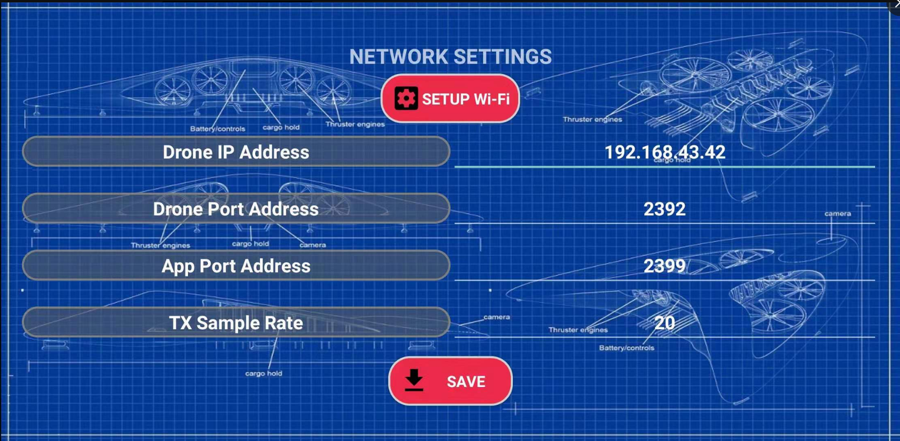
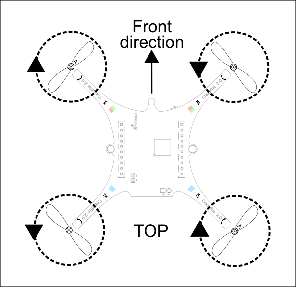

## 项目预览

esp-plane 是基于乐鑫 ESP32/ESP32-S2 开发的小型无人机解决方案，可使用手机 APP 或游戏手柄通过 Wi-Fi 网络进行连接和控制，目前已支持自稳定飞行、定高飞行、定点飞行等多种模式。该方案硬件结构简单，代码架构清晰，支持功能扩展，可用于 STEAM 教育等领域。项目部分代码来自 Crazyflie 开源工程，继承 GPL3.0 开源协议。


### 功能介绍

1. 支持自稳定模式：自动控制机身水平，保持平稳飞行
2. 支持定高模式：自动控制油门输出，保持固定高度
3. 支持定点模式：自动控制机身角度，保持固定空间位置
4. 支持 PC 上位机调试：使用 cfclient 上位机进行静态/动态调试
5. 支持 APP 控制：使用手机 APP 通过 Wi-Fi 轻松控制
6. 支持游戏手柄控制：通过 cfclient 使用游戏手柄轻松控制

```
部分翻译建议
自稳定模式- stabilize mode
定高模式- height-hold mode
定点模式- position-hold mode
游戏手柄- gamepad
```

### 硬件组成结构

**ESPLane 2.0 使用模块化的设计思路，由主控板和扩展板组成：**

1. **主控制板**：搭载支持基础飞行的必要元器件，提供硬件扩展接口
2. **扩展板**：基于硬件扩展接口，用于支持高级飞行功能或其他 DIY 功能

|序号| 模块名 | 主要元器件 | 功能 | 接口 |安装位置 |
|--|--|--|--|--|--|
|1| **主控制板-ESP32** |  ESP32-WROOM + MPU6050|基础飞行  |提供 I2C SPI GPIO 扩展接口  ||
|1| **主控制板-ESP32-S2** |  ESP32-S2-WROVER + MPU6050| 基础飞行 |提供 I2C SPI GPIO 扩展接口  ||
|2|扩展板- **定点模块** |  PMW3901 + VL53L1X | 室内定点飞行 | SPI + I2C | 底部，面向地面 |
|3| 扩展板-**气压定高模块** |  MS5611 气压 | 气压定高 | I2C 或 MPU6050从机|顶部或底部 |
|4| 扩展板-指南针模块 |  HMC5883 罗盘 | 无头模式等高级模式 | I2C 或 MPU6050从机|顶部或底部 |

### 软件目录结构

**项目软件主要由飞控内核、硬件驱动和依赖库组成**

1. 飞控内核来自 crazyflie 开源工程，主要包括硬件抽象层和飞控程序
2. 硬件驱动按照硬件接口进行了文件结构划分，包括 I2C 设备和 SPI 设备等
3. 依赖库包括 ESP-IDF 提供的默认组件，以及来自第三方的 DSP 等

具体文件结构如下所示：

```
.
├── components                        | 项目组件目录
│   ├── config                              | 系统 task 配置
│   │   └── include
│   ├── core                                 | 系统内核目录
│   │   └── crazyflie                  | crazyflie 内核
│   │       ├── hal                         | 硬件抽象代码 
│   │       └── modules             |  飞行控制代码 
│   ├── drivers                            | 硬件驱动目录
│   │   ├── deck                         | 硬件扩展接口驱动
│   │   ├── general                    | 一般设备目录
│   │   │   ├── adc                     | ADC 驱动，用于电压监测
│   │   │   ├── buzzer              | 蜂鸣器驱动，用于状态反馈
│   │   │   ├── led                     | LED驱动，用于状态反馈
│   │   │   ├── motors             | 电机驱动，用于推力输出
│   │   │   └── wifi                    | Wi-Fi 驱动，用于通信
│   │   ├── i2c_bus                   | I2C 驱动
│   │   ├── i2c_devices           | I2C 设备目录
│   │   │   ├── eeprom           | eeprom驱动，用于参数存储
│   │   │   ├── hmc5883l         | hmc5883l 磁罗盘传感器
│   │   │   ├── mpu6050          | mpu6050 陀螺仪加速度计传感器
│   │   │   ├── ms5611             | ms5611 气压传感器
│   │   │   ├── vl53l0                 | Ivl53l0 2m 激光传感器
│   │   │   └── vl53l1                 |  Ivl53l1 4m 激光传感器
│   │   └── spi_devices           | SPI 设备目录
│   │       └── pmw3901           | pmw3901 光流传感器
│   ├── lib                                      | 外部库目录
│   │   └── dsp_lib                    | dsp 库
│   ├── platform                         | 用于支持多平台
│   └── utils                                  | 工具函数目录
├── CMakeLists.txt                    | 工具函数
├── LICENSE                                | 开源协议
├── main                                       | 入口函数
├── README.md                        | 项目说明
└── sdkconfig.defaults            | 默认参数
```

### ESP-IDF 简介

ESP-IDF 是乐鑫为 ESP32/ESP32-S2 提供的物联网开发框架。

* ESP-IDF 包含一系列库及头文件，提供了基于 ESP32/ESP32-S2 构建软件项目所需的核心组件。
* ESP-IDF 还提供了开发和量产过程中最常用的工具及功能，例如：构建、烧录、调试和测量等。

### Crazyflie 简介

Crazyflie 是来自 bitcraze 开源工程的四旋翼飞行器。

* Crazyflie 支持多种传感器组合，可以轻松实现定高模式、定点模式等高级飞行模式。
* Crazyflie 基于 FreeRTOS 编写，将复杂的无人机系统，分解成多个具有不同优先级的软件任务。
* Crazyflie 设计了功能完备的 cfclient 上位机和 CRTP 通信协议，便于实现调试、测量和控制。


## 使用指引

### 1. 安装ESPilot APP

该版本 APP 目前只支持一般控制模式，不支持参数调整，不支持定高控制。APP 获取和配置如下所示，配置完成后即可起飞，如需使用游戏手柄控制，请参考2 3 4步骤：




| 网络设置 | 默认值 |
| :--- | :--- |
| Drone IP | 192.168.43.42 |
| Drone Port | 2392 |
| APP Port | 2399 |
| TX Rate | 20 |


>或使用未发布的测试版本 APP（免配置） ：https://github.com/qljz1993/DailyMD_public/blob/master/esplanes2_test/esplane-android-client-4-14-debug.apk

### 2. 安装crtp协议支持包

2.1 下载源代码 

```text
git clone -b dev_esplane  https://github.com/qljz1993/crazyflie-lib-python.git
```

2.2 进入源码目录，安装依赖 

```text
pip3 install -r requirements.txt
```

2.3 安装crtp包 

```text
pip3 install -e .
```

> 其他参考：[https://github.com/qljz1993/crazyflie-lib-python/tree/master](https://github.com/qljz1993/crazyflie-lib-python/tree/master)

### 3. 安装cfclient

3.1 下载源代码

```text
git clone -b dev_esplane https://github.com/qljz1993/crazyflie-clients-python.git
```

3.2  进入源码目录，安装依赖 

```text
sudo apt-get install python3 python3-pip python3-pyqt5 python3-pyqt5.qtsvg
```

3.3  安装cfclient客户端

```text
pip3 install -e .
```

3.4 启动客户端


```text
python3 ./bin/cfclient
```

### 4. 配置遥控器


1. 配置4个控制轴 `Roll 、Pitch、Yaw、Thrust`
2. 配置一个按键为`Assisted control` ，用于飞行模式切换

### 注意事项 😃 

1. 注意检查电机自检时转向是否正确，见下图 😇 
2. 注意观察上位机水平面是否置平 😏 
3. 轻轻推小油门试一下 🤔 
4. 起飞吧 🌈 




## 开发指引

### 1. 设置 ESP-IDF

请参照ESP-IDF 入门指南： [https://docs.espressif.com/projects/esp-idf/en/latest/esp32s2/get-started/index.html](https://docs.espressif.com/projects/esp-idf/en/latest/esp32s2/get-started/index.html)，按照步骤设置 ESP-IDF。

注意事项：
1. 请完成链接页面的所有步骤。
2. 请按照上面链接中的步骤构建一个或多个示例应用程序。

### 2. 获取项目源代码

测试版本代码，目前放在 gitlab 仓库，使用 git 工具获取

```
git clone -b feature/develop https://gitlab.espressif.cn:6688/esp-college/esp-plane.git
```

### 3. 配置项目（可选）

3.1 ESP32 链接脚本修改

如果删除项目目录下的`esp32-s2`组件，需要对 ESP-IDF 目录下的`esp32-s2`组件链接脚本进行配置，目的是将 esplane 固件中的 带有`param`或`log`标签的变量，放置在连续的地址区域

在`{IDF_PATH}/components/esp32s2/ld/esp32s2.project.ld.in`文件中找到`drom0_0_seg`段，该段段尾添加以下内容：

```
    /* Parameters and log system datas >drom0_0_seg*/
    _param_start = .;
    KEEP(*(.param))
    KEEP(*(.param.*))
    _param_stop = .;
    . = ALIGN(4);
    _log_start = .;
    KEEP(*(.log))
    KEEP(*(.log.*))
    _log_stop = .;
    . = ALIGN(4);
```

3.2 提高 PHY 增益

依次进入：`Component config>>PHY>>Max WiFi TX power (dBm)`
将 `Max WiFi TX power` 改为 `20`，提高 Wi-Fi 通信距离。
