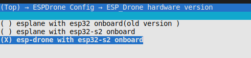

# 硬件参考

## 已支持硬件

### 已支持硬件清单

| 开发板名  | 主要配置 | 备注 |
|:--:|:--:|:--:|
|ESP32-S2-Drone V1.2|ESP32-S2-WROVER + MPU6050|一体化|
|ESPlane-V2-S2|ESP32-S2-WROVER + MPU6050|需安装脚架|
|ESPlane-FC-V1|ESP32-WROOM-32D + MPU6050|需安装机架|

### 硬件切换方法

* `esp_drone` 仓库代码已支持多种硬件，可通过 `menuconfig` 进行切换。

    

* 默认情况下，`set-target` 设为 `esp32s2`后，硬件自动切换为 `ESP32_S2_Drone_V1_2`。
* 默认情况下，`set-target` 设为 `esp32` 后，硬件自动切换为 `ESPlane_FC_V1`。

**注意事项**

1. ESPlane-FC-V1 为老版本硬件。
2. ESPlane-FC-V1 使用 ESP-Drone 新版本代码，需要对硬件进行改动，即使用跳线，将模组 GPIO14 连接到 mpu6050 int 管脚。
3. ESPlane-FC-V1 防止上电时 IO12 触发 flash 电压切换，使用 `espefuse.py` 将 flash 电压固定到 3.3 V：

    `espefuse.py --port /dev/ttyUSB0 set_flash_voltage 3.3V`

    ```note * Only the first device attaching to the bus can use CS0 pin.```
    
    注意，仅有第一个连接到总线的设备可以使用 CS0 管脚。

## ESP32-S2-Drone V1.2


主板原理图：[SCH_Mainboard_ESP32_S2_Drone_V1_2](./_static/ESP32_S2_Drone_V1_2/SCH_Mainboard_ESP32_S2_Drone_V1_2.pdf)

主板 PCB：[PCB_Mainboard_ESP32_S2_Drone_V1_2](./_static/ESP32_S2_Drone_V1_2/PCB_Mainboard_ESP32_S2_Drone_V1_2.pdf)

### 基础配置

#### 基础配置清单


| 基础配置清单  | 数量 | 备注 |
|:--:|:--:|:--:|
|主板|1|ESP32-S2-WROVER + MPU6050|
|716 电机|4|可配置 720 电机|
|716 电机橡胶圈 |4 | |
|46mm 螺旋桨 A|2|可配置 55mm 桨|
|46mm 螺旋桨 B|2||
|300mAh 1s 锂电池|1|可配置 350mAh 高倍率|
|1s 锂电池充电板|1|||
|8-pin 25 mm 排针|2||

注意：更换 720 电机之后，需要在 `menuconfig->ESPDrone Config->motors config` 将 `motor type` 修改为 `brushed 720 motor` 

#### 主控制器

| 芯片型号  | 模组型号 | 备注 |
|--|--|--|
| ESP32-S2 | ESP32-S2-WROVER | 模组内置 4 MB flash，2 MB PSRAM |

#### 传感器

| 传感器  | 接口 | 备注 |
|--|--|--|
| MPU6050 | I2C0 | 主板传感器 |

#### 指示灯

| 状态 | LED | 动作 |
|--|--|--|
|POWER_ON|WHITE|常亮|
|SENSORS CALIBRATION|BLUE|慢速闪烁|
|SYSTEM READY|BLUE|正常闪烁|
|UDP_RX|GREEN|闪烁|
|LOW_POWER|RED|常亮|

#### 按键

| 按键 | IO | 功能 |
|--|--|--|
|SW1|GPIO1|Boot, Normal|
|SW2|EN|Reset|


#### 主板 IO 定义

| 管脚 | 功能 | 备注 |
| :---: | :---: | :---: |
| GPIO11 | I2C0_SDA | MPU6050 专用|
| GPIO10 | I2C0_SCL | MPU6050 专用|
| GPIO37 | SPI_MISO | MISO |
| GPIO35 | SPI_MOSI |MOSI |
| GPIO36 | SPI_CLK|SCLK|
| GPIO34 | SPI_CS0|CS0* |
| GPIO40 | I2C1_SDA|VL53L1X|
| GPIO41 | I2C1_SCL |VL53L1X|
| GPIO12 | interrupt | MPU6050 interrupt |
| GPIO39 |  BUZ_1|BUZZ+ |
| GPIO38 |BUZ_2| BUZZ- | 
| GPIO8 | LED\_RED | LED\_1 |
| GPIO9 | LED\_GREEN | LED\_2 |
| GPIO7 | LED\_BLUE | LED\_3 |
| GPIO5 | MOT\_1 | |
| GPIO6 | MOT\_2 | |
| GPIO3 | MOT\_3 | |
| GPIO4 | MOT\_4 | |
| GPIO2 | ADC\_7\_BAT | VBAT/2 |
| GPIO1 |EXT_IO1  |  |

#### 摄像头接口

| 管脚 | 功能 | 备注 |
| :---: | :---: | :---: |
|GPIO13  |  CAM_VSYNC|  |
|GPIO14  |  CAM_HREF|  |
|GPIO15  |  CAM_Y9|  |
|GPIO16  |  CAM_XCLK|  |
|GPIO17  |CAM_Y8  |  |
|GPIO18  |CAM_RESET  |  
|GPIO19  |CAM_Y7  |  |
|GPIO20  |  CAM_PCLK|  |
|GPIO21  |  CAM_Y6|  ||
|GPIO33  |CAM_Y2  |  ||
|GPIO45 |  CAM_Y4| 
|GPIO46  |CAM_Y3  | 

### 扩展配置

| 扩展板 | 主要传感器 | 功能 | 接口 |安装位置 |
|--|--|--|--|--|
|扩展板- 定点模块 |  PMW3901 + VL53L1X | 室内定点飞行 | SPI + I2C | 底部，面向地面 |
| 扩展板-气压定高模块 |  MS5611 气压 | 气压定高 | I2C 或 MPU6050从机|顶部或底部 |
| 扩展板-指南针模块 |  HMC5883 罗盘 | 无头模式等高级模式 | I2C 或 MPU6050从机|顶部或底部 |

扩展板原理图：待发布

扩展板 PCB：待发布

#### 扩展板 IO 定义

| 左管脚 | IO |功能 | 右管脚 | IO |功能|
| :---: | :---: | :---: | :---: | :---: | :---:|
|SPI_CS0  | GPIO34 |功能 | VDD_33 | IO |功能|
|SPI_MOSI |GPIO35 | |I2C0_SDA |GPIO11| |
| SPI_CLK| GPIO36| | I2C0_SCL|GPIO10 | |
| SPI_MISO|GPIO37 | | GND| | |
| GND| | | AUX_SCL| | |
| I2C1_SDA| GPIO40| | AUX_SDA| | |
| I2C1_SCL|GPIO41 | | BUZ_2|GPIO38 | |
| EXT_IO1| GPIO1| | BUZ_1|GPIO39 | |

## ESPlane-V2-S2


主板原理图：[SCH_ESPlane_V2_S2](./_static/ESPlane_V2_S2/SCH_ESPlane_V2_S2.pdf)

主板 PCB：[PCB_ESPlane_V2_S2](./_static/ESPlane_V2_S2/PCB_ESPlane_V2_S2.pdf)


## ESPlane-FC-V1


主板原理图：[Schematic_ESPlane_FC_V1](./_static/ESPlane_FC_V1/Schematic_ESPlane_FC_V1.pdf)

主板 PCB：[PCB_ESPlane_FC_V1](./_static/ESPlane_FC_V1/PCB_ESPlane_FC_V1.pdf)


### 基础配置

#### 基础配置清单

| 配置清单  | 数量 | 备注 |
|:--:|:--:|:--:|
|主板|1|ESP32-WROOM-32D + MPU6050|
|机架|1||
|46 mm 螺旋桨 A|2||
|46 mm 螺旋桨 B|2||
|300 mAh 1s 锂电池|1||
|1s 锂电池充电板|1|||

#### 传感器

| 传感器  | 接口 | 备注 |
|--|--|--|
| MPU6050 | I2C0 | 必需 |

#### 指示灯

```
#define LINK_LED         LED_BLUE
//#define CHG_LED          LED_RED
#define LOWBAT_LED       LED_RED
//#define LINK_DOWN_LED  LED_BLUE
#define SYS_LED          LED_GREEN 
#define ERR_LED1         LED_RED
#define ERR_LED2         LED_RED
```

| 状态 | LED | 动作 |
|--|--|--|
|SENSORS READY|BLUE|常亮|
|SYSTEM READY|BLUE|常亮|
|UDP_RX|GREEN|闪烁|

#### 主板 IO 定义

| 管脚 | 功能 | 备注 |
| :---: | :---: | :---: |
| GPIO21 | SDA | I2C0 数据 |
| GPIO22 | SCL | I2C0 时钟 |
| GPIO14 | SRV\_2 | MPU6050 中断 |
| GPIO16 | RX2 |  |
| GPIO17 | TX2 |  |
| GPIO27 | SRV\_3 | UART2 CTS |
| GPIO26 | SRV\_4 | UART2 RTS %需要修改 |
| GPIO23 | LED\_RED | LED\_1 |
| GPIO5 | LED\_GREEN | LED\_2 |
| GPIO18 | LED\_BLUE | LED\_3 |
| GPIO4 | MOT\_1 |  |
| GPIO33 | MOT\_2 |  |
| GPIO32 | MOT\_3 |  |
| GPIO25 | MOT\_4 |  |
| TXD0 |  |  |
| RXD0 |  |  |
| GPIO35 | ADC\_7\_BAT | VBAT/2 |

### 扩展配置

#### ESPlane + PMW3901 管脚配置

| 管脚 | 功能 | 备注 |
| :---: | :---: | :---: |
| GPIO21 | SDA | I2C0 数据 |
| GPIO22 | SCL | I2C0 时钟 |
| GPIO12 | MISO/SRV\_1 | HSPI |
| GPIO13 | MOSI | HSPI  |
| GPIO14 | SCLK/SRV\_2 | HSPI ~~MPU6050 中断~~ |
| GPIO15 | CS0* | HSPI  |
| GPIO16 | RX2 |  |
| GPIO17 | TX2 |  |
| GPIO19 | interrupt | MPU6050 中断 |
| GPIO27 | SRV\_3 | UART2 CTS |
| GPIO26 | SRV\_4 | UART2 RTS %需要修改 |
| GPIO23 | LED\_RED | LED\_1 |
| GPIO5 | LED\_GREEN | LED\_2 |
| GPIO18 | LED\_BLUE | LED\_3 |
| GPIO4 | MOT\_1 |  |
| GPIO33 | MOT\_2 |  |
| GPIO32 | MOT\_3 |  |
| GPIO25 | MOT\_4 |  |
| TXD0 |  |  |
| RXD0 |  |  |
| GPIO35 | ADC\_7\_BAT | VBAT/2 |
