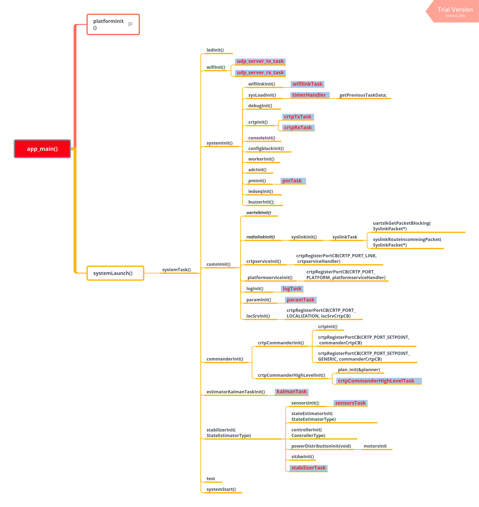
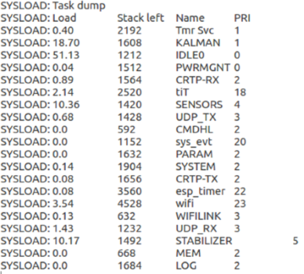
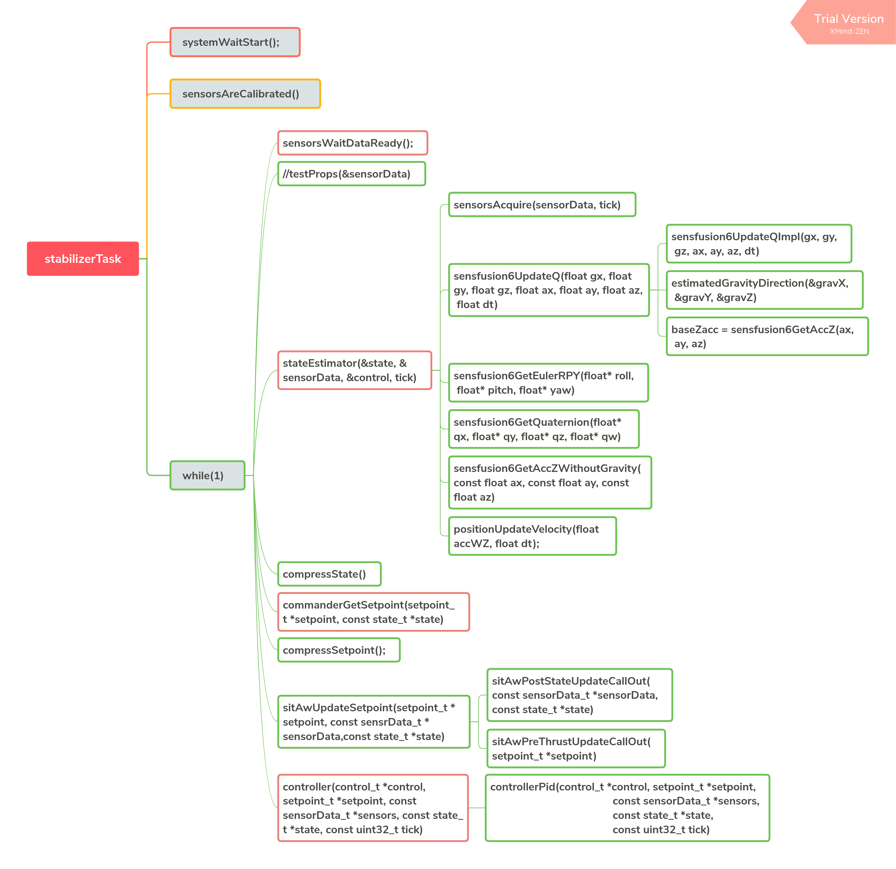
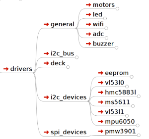
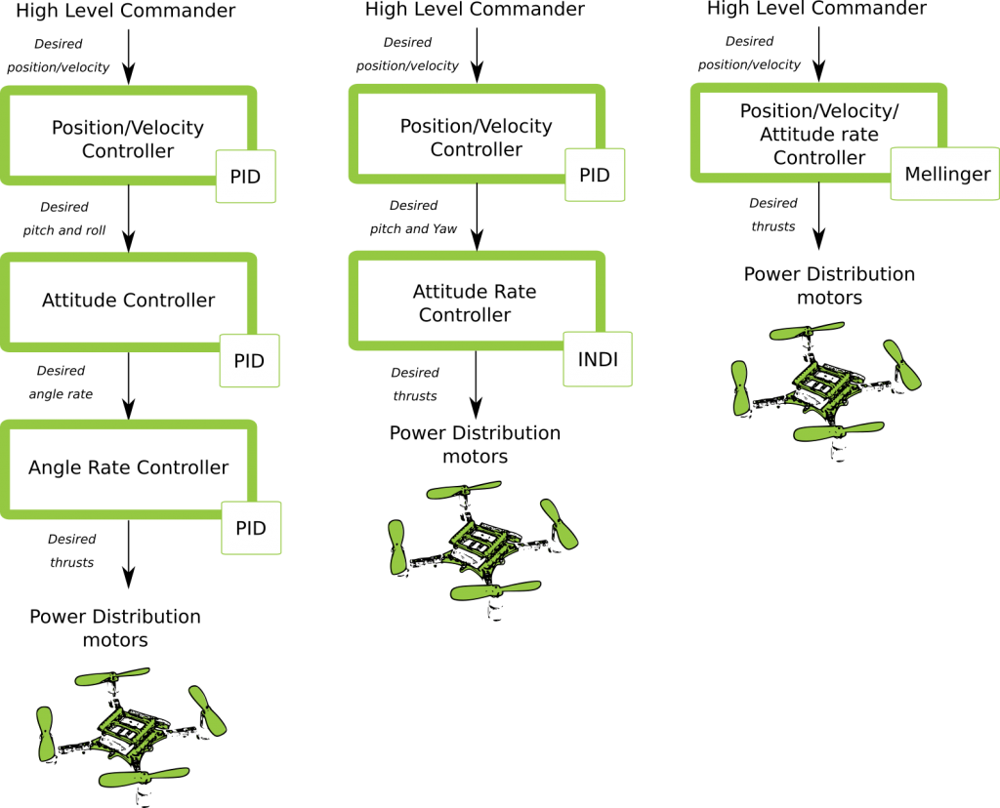

# 飞控系统

## 系统启动流程



查阅源文件：[start_from_app_main](./_static/start_from_app_main.pdf)。

## 系统任务管理

### 系统任务简介

系统正常运行时，将启动以下 TASK。



其中，
* Load：CPU 占用率；
* Stack Left：剩余堆栈空间；
* Name：TASK 名称；
* PRI：TASK 优先级。

TASK 具体描述如下：

* PWRMGNT：系统电压监测
* CMDHL：应用层-处理根据 CRTP 协议构成的高级命令
* CRTP-RX：协议层-CRTP 飞行协议解码
* CRTP-TX：协议层-CRTP 飞行协议解码
* UDP-RX：传输层-UDP 包接收
* UDP-TX：传输层-UDP 包发送
* WIFILINK：对接 CRTP 协议层和 UDP 传输层
* SENSORS：传感器数据读取和预处理
* KALMAN：使用传感器数据进行飞机状态估计，包括飞机角度、角速度、空间位置的估计。该 TASK 在 ESP 芯片上 CPU 资源消耗较大，应注意优先级的分配。
* PARAM：使用 CRTP 协议远程修改变量
* LOG：使用 CRTP 协议实时监控变量
* MEM：使用 CRTP 协议远程修改存储器
* STABILIZER：自稳定线程，控制飞控程序运行流程
* SYSTEM：控制系统初始化和自检流程

### 任务堆栈空间配置

用户可以在 `components/config/include/config.h` 中直接修改空间大小，也可以在 `menucfg` 中修改 `BASE_STACK_SIZE` 大小。使用 `ESP32` 时可将 `BASE_STACK_SIZE` 调整为 2048，减小踩内存的概率；使用 `ESP32-S2` 时，建议将该值调整为 `1024`。

```
//任务堆栈空间大小
#define SYSTEM_TASK_STACKSIZE         (4* configBASE_STACK_SIZE)
#define ADC_TASK_STACKSIZE            configBASE_STACK_SIZE
#define PM_TASK_STACKSIZE             (2*configBASE_STACK_SIZE)
#define CRTP_TX_TASK_STACKSIZE        (2*configBASE_STACK_SIZE)
#define CRTP_RX_TASK_STACKSIZE        (2* configBASE_STACK_SIZE)
#define CRTP_RXTX_TASK_STACKSIZE      configBASE_STACK_SIZE
#define LOG_TASK_STACKSIZE            (2*configBASE_STACK_SIZE)
#define MEM_TASK_STACKSIZE            (1 * configBASE_STACK_SIZE)
#define PARAM_TASK_STACKSIZE          (2*configBASE_STACK_SIZE)
#define SENSORS_TASK_STACKSIZE        (2 * configBASE_STACK_SIZE)
#define STABILIZER_TASK_STACKSIZE     (2 * configBASE_STACK_SIZE)
#define NRF24LINK_TASK_STACKSIZE      configBASE_STACK_SIZE
#define ESKYLINK_TASK_STACKSIZE       configBASE_STACK_SIZE
#define SYSLINK_TASK_STACKSIZE        configBASE_STACK_SIZE
#define USBLINK_TASK_STACKSIZE        configBASE_STACK_SIZE
#define WIFILINK_TASK_STACKSIZE        (2*configBASE_STACK_SIZE)
#define UDP_TX_TASK_STACKSIZE   (2*configBASE_STACK_SIZE)
#define UDP_RX_TASK_STACKSIZE   (2*configBASE_STACK_SIZE)
#define UDP_RX2_TASK_STACKSIZE   (1*configBASE_STACK_SIZE)
#define PROXIMITY_TASK_STACKSIZE      configBASE_STACK_SIZE
#define EXTRX_TASK_STACKSIZE          configBASE_STACK_SIZE
#define UART_RX_TASK_STACKSIZE        configBASE_STACK_SIZE
#define ZRANGER_TASK_STACKSIZE        (1* configBASE_STACK_SIZE)
#define ZRANGER2_TASK_STACKSIZE       (2* configBASE_STACK_SIZE)
#define FLOW_TASK_STACKSIZE           (2* configBASE_STACK_SIZE)
#define USDLOG_TASK_STACKSIZE         (1* configBASE_STACK_SIZE)
#define USDWRITE_TASK_STACKSIZE       (1* configBASE_STACK_SIZE)
#define PCA9685_TASK_STACKSIZE        (1* configBASE_STACK_SIZE)
#define CMD_HIGH_LEVEL_TASK_STACKSIZE (1* configBASE_STACK_SIZE)
#define MULTIRANGER_TASK_STACKSIZE    (1* configBASE_STACK_SIZE)
#define ACTIVEMARKER_TASK_STACKSIZE   configBASE_STACK_SIZE
#define AI_DECK_TASK_STACKSIZE        configBASE_STACK_SIZE
#define UART2_TASK_STACKSIZE          configBASE_STACK_SIZE
```


### 任务优先级配置

系统 TASK 优先级可以在 `components/config/include/config.h` 中进行配置。由于 `ESP32` 具有双核优势，相比 `ESP32-S2` 计算资源更加富余，可将高耗时的 `KALMAN_TASK` 优先级调高。在使用 `ESP32-S2` 时，需要将高耗时的 `KALMAN_TASK` 优先级调低，否则难以释放足够的 CPU 资源，将触发 task watchdog。

```
// 任务优先级，数字越大，优先级越高。
#define STABILIZER_TASK_PRI     5
#define SENSORS_TASK_PRI        4
#define ADC_TASK_PRI            3
#define FLOW_TASK_PRI           3
#define MULTIRANGER_TASK_PRI    3
#define SYSTEM_TASK_PRI         2
#define CRTP_TX_TASK_PRI        2
#define CRTP_RX_TASK_PRI        2
#define EXTRX_TASK_PRI          2
#define ZRANGER_TASK_PRI        2
#define ZRANGER2_TASK_PRI       2
#define PROXIMITY_TASK_PRI      0
#define PM_TASK_PRI             0
#define USDLOG_TASK_PRI         1
#define USDWRITE_TASK_PRI       0
#define PCA9685_TASK_PRI        2
#define CMD_HIGH_LEVEL_TASK_PRI 2
#define BQ_OSD_TASK_PRI         1
#define GTGPS_DECK_TASK_PRI     1
#define LIGHTHOUSE_TASK_PRI     3
#define LPS_DECK_TASK_PRI       5
#define OA_DECK_TASK_PRI        3
#define UART1_TEST_TASK_PRI     1
#define UART2_TEST_TASK_PRI     1
//if task watchdog triggered, KALMAN_TASK_PRI should set lower or set lower flow frequency
#ifdef TARGET_MCU_ESP32
  #define KALMAN_TASK_PRI         2
  #define LOG_TASK_PRI            1
  #define MEM_TASK_PRI            1
  #define PARAM_TASK_PRI          1
#else
  #define KALMAN_TASK_PRI         1
  #define LOG_TASK_PRI            2
  #define MEM_TASK_PRI            2
  #define PARAM_TASK_PRI          2
#endif

#define SYSLINK_TASK_PRI        3
#define USBLINK_TASK_PRI        3
#define ACTIVE_MARKER_TASK_PRI  3
#define AI_DECK_TASK_PRI        3
#define UART2_TASK_PRI          3
#define WIFILINK_TASK_PRI       3
#define UDP_TX_TASK_PRI         3
#define UDP_RX_TASK_PRI         3
#define UDP_RX2_TASK_PRI        3
```

## 关键任务介绍

除了系统默认开启的 TASK（如 Wi-Fi TASK），优先级最高的 TASK 是 `STABILIZER_TASK`，凸显了这个任务的重要性。`STABILIZER_TASK` 控制了从传感器数据读取，到姿态计算，到目标接收，到最终输出电机功率的整个过程，驱动各个阶段的算法运行。




## 传感器驱动

传感器驱动代码，可以在 `components\drivers` 中查阅。`drivers` 使用了与 [esp-iot-solution](https://github.com/espressif/esp-iot-solution/) 类似的文件结构，将驱动程序按照所属总线进行分类，包括 `i2c_devices`、`spi_devices`、`general` 等。具体可参考：[驱动程序](./drivers)。



## 传感器硬件抽象

`components\core\crazyflie\hal\src\sensors.c` 文件对传感器进行了硬件抽象，开发者可以自由组合传感器，通过实现硬件抽象层定义的传感器接口，与上层应用进行对接。

```
typedef struct {
  SensorImplementation_t implements;
  void (*init)(void);
  bool (*test)(void);
  bool (*areCalibrated)(void);
  bool (*manufacturingTest)(void);
  void (*acquire)(sensorData_t *sensors, const uint32_t tick);
  void (*waitDataReady)(void);
  bool (*readGyro)(Axis3f *gyro);
  bool (*readAcc)(Axis3f *acc);
  bool (*readMag)(Axis3f *mag);
  bool (*readBaro)(baro_t *baro);
  void (*setAccMode)(accModes accMode);
  void (*dataAvailableCallback)(void);
} sensorsImplementation_t;
```

ESP-Drone 实现的传感器抽象接口在 `components/core/crazyflie/hal/src/sensors_mpu6050_hm5883L_ms5611.c` 中，通过以下赋值过程与上层应用对接：

```
#ifdef SENSOR_INCLUDED_MPU6050_HMC5883L_MS5611
  {
    .implements = SensorImplementation_mpu6050_HMC5883L_MS5611,
    .init = sensorsMpu6050Hmc5883lMs5611Init,
    .test = sensorsMpu6050Hmc5883lMs5611Test,
    .areCalibrated = sensorsMpu6050Hmc5883lMs5611AreCalibrated,
    .manufacturingTest = sensorsMpu6050Hmc5883lMs5611ManufacturingTest,
    .acquire = sensorsMpu6050Hmc5883lMs5611Acquire,
    .waitDataReady = sensorsMpu6050Hmc5883lMs5611WaitDataReady,
    .readGyro = sensorsMpu6050Hmc5883lMs5611ReadGyro,
    .readAcc = sensorsMpu6050Hmc5883lMs5611ReadAcc,
    .readMag = sensorsMpu6050Hmc5883lMs5611ReadMag,
    .readBaro = sensorsMpu6050Hmc5883lMs5611ReadBaro,
    .setAccMode = sensorsMpu6050Hmc5883lMs5611SetAccMode,
    .dataAvailableCallback = nullFunction,
  }
#endif
```

## 传感器校准过程

### 陀螺仪校准过程

由于陀螺仪存在较大的温漂，因此每次使用前需要对陀螺仪进行校准，计算当前环境下的陀螺仪基准值。ESP-Drone 延续 Crazyflie 2.0 陀螺仪校准方案，在初次上电时，计算陀螺仪三个轴的方差与平均值。

陀螺仪具体校准过程如下：

1. 使用一个最大长度为 1024 的环形缓冲区，存储最新的 1024 组陀螺仪测量值。
2. 通过计算陀螺仪输出值方差，确认飞行器已经放置平稳并且陀螺仪工作正常。
3. 确认第 2 步正常后，计算静止时 1024 组陀螺仪输出值的平均值，作为陀螺仪的校准值。


**陀螺仪基准值计算源代码：**

```
/**
 * Adds a new value to the variance buffer and if it is full
 * replaces the oldest one. Thus a circular buffer.
 */
static void sensorsAddBiasValue(BiasObj* bias, int16_t x, int16_t y, int16_t z)
{
  bias->bufHead->x = x;
  bias->bufHead->y = y;
  bias->bufHead->z = z;
  bias->bufHead++;

  if (bias->bufHead >= &bias->buffer[SENSORS_NBR_OF_BIAS_SAMPLES])
  {
    bias->bufHead = bias->buffer;
    bias->isBufferFilled = true;
  }
}

/**
 * Checks if the variances is below the predefined thresholds.
 * The bias value should have been added before calling this.
 * @param bias  The bias object
 */
static bool sensorsFindBiasValue(BiasObj* bias)
{
  static int32_t varianceSampleTime;
  bool foundBias = false;

  if (bias->isBufferFilled)
  {
    sensorsCalculateVarianceAndMean(bias, &bias->variance, &bias->mean);

    if (bias->variance.x < GYRO_VARIANCE_THRESHOLD_X &&
        bias->variance.y < GYRO_VARIANCE_THRESHOLD_Y &&
        bias->variance.z < GYRO_VARIANCE_THRESHOLD_Z &&
        (varianceSampleTime + GYRO_MIN_BIAS_TIMEOUT_MS < xTaskGetTickCount()))
    {
      varianceSampleTime = xTaskGetTickCount();
      bias->bias.x = bias->mean.x;
      bias->bias.y = bias->mean.y;
      bias->bias.z = bias->mean.z;
      foundBias = true;
      bias->isBiasValueFound = true;
    }
  }

  return foundBias;
}
```

**修正陀螺仪输出值：**

```
    sensorData.gyro.x = (gyroRaw.x - gyroBias.x) * SENSORS_DEG_PER_LSB_CFG;
    sensorData.gyro.y = (gyroRaw.y - gyroBias.y) * SENSORS_DEG_PER_LSB_CFG;
    sensorData.gyro.z = (gyroRaw.z - gyroBias.z) * SENSORS_DEG_PER_LSB_CFG;
    applyAxis3fLpf((lpf2pData *)(&gyroLpf), &sensorData.gyro); //低通滤波器，去除高频干扰
```


### 加速度计校准过程

#### 重力加速度校准

在地球不同的纬度和海拔下，重力加速度 g 值一般不同，因此需要使用加速度计对 g 进行实际测量。可参考 Crazyflie 2.0 加速度计校准方案，g 值的校准过程如下：

1. 陀螺仪校准完成后，立刻进行加速度计校准。
2. 使用 Buffer 保存 200 组加速度计测量值。 
3. 通过合成重力加速度在三个轴的分量，计算重力加速度在静止状态下的值。

参考：[不同地球纬度和海拔下的重力加速度值 g](https://baike.baidu.com/item/%E9%87%8D%E5%8A%9B%E5%8A%A0%E9%80%9F%E5%BA%A6/23553)。 

**计算静止状态下重力加速度值：**

```
/**
 * Calculates accelerometer scale out of SENSORS_ACC_SCALE_SAMPLES samples. Should be called when
 * platform is stable.
 */
static bool processAccScale(int16_t ax, int16_t ay, int16_t az)
{
    static bool accBiasFound = false;
    static uint32_t accScaleSumCount = 0;

    if (!accBiasFound)
    {
        accScaleSum += sqrtf(powf(ax * SENSORS_G_PER_LSB_CFG, 2) + powf(ay * SENSORS_G_PER_LSB_CFG, 2) + powf(az * SENSORS_G_PER_LSB_CFG, 2));
        accScaleSumCount++;

        if (accScaleSumCount == SENSORS_ACC_SCALE_SAMPLES)
        {
            accScale = accScaleSum / SENSORS_ACC_SCALE_SAMPLES;
            accBiasFound = true;
        }
    }

    return accBiasFound;
}
```

**通过实际重力加速度值，修正加速度计测量值：**

```
    accScaled.x = (accelRaw.x) * SENSORS_G_PER_LSB_CFG / accScale;
    accScaled.y = (accelRaw.y) * SENSORS_G_PER_LSB_CFG / accScale;
    accScaled.z = (accelRaw.z) * SENSORS_G_PER_LSB_CFG / accScale;
```


#### 机身水平校准

理想状态下，加速度传感器在飞机上完全水平地进行安装，进而可以使用 0 位置作为飞机的水平面。但由于加速度计在安装时不可避免的存在一定的倾角，导致飞控错误估计水平位置，导致飞机向某个方向偏飞。因此需要设置一定的校准策略来平衡这种误差。

1. 将飞机放置在一个水平面上，计算飞机 `cosRoll`、`sinRoll`、`cosPitch`、`sinPitch`。理想状态下 `cosRoll`、`cosPitch` 为 1，`sinPitch`、`sinRoll` 为 0。如果不是水平安装 `sinPitch`、`sinRoll` 不为 0，`cosRoll` `cosPitch` 不为 1。
2. 将步骤 1 的 `cosRoll`、`sinRoll`、`cosPitch`、`sinPitch` 或对应的 `Roll`、`Pitch` 角度值保存到飞机，用于校准。


**利用校准值，对加速度计测量值进行修正：**

```
/**
 * Compensate for a miss-aligned accelerometer. It uses the trim
 * data gathered from the UI and written in the config-block to
 * rotate the accelerometer to be aligned with gravity.
 */
static void sensorsAccAlignToGravity(Axis3f *in, Axis3f *out)
{
    //TODO: need cosPitch calculate firstly
    Axis3f rx;
    Axis3f ry;

    // Rotate around x-axis
    rx.x = in->x;
    rx.y = in->y * cosRoll - in->z * sinRoll;
    rx.z = in->y * sinRoll + in->z * cosRoll;

    // Rotate around y-axis
    ry.x = rx.x * cosPitch - rx.z * sinPitch;
    ry.y = rx.y;
    ry.z = -rx.x * sinPitch + rx.z * cosPitch;

    out->x = ry.x;
    out->y = ry.y;
    out->z = ry.z;
}
```

以上过程，可通过力的分解和勾股定理推导。

## 姿态计算

### 支持的姿态计算算法

* 互补滤波
* 卡尔曼滤波

ESP-Drone 姿态计算代码来自 `Crazyflie`。ESP-Drone 固件已经对互补滤波和卡尔曼滤波进行了实际测试，可以有效地计算飞行姿态，包括各个自由度的角度、角速度、和空间位置，为控制系统提供了可靠的状态输入。需要注意的是，在定点模式下，必须切换到卡尔曼滤波算法，才能保证工作正常。

Crazyflie 状态估计见 [State estimation: To be or not to be!](https://www.bitcraze.io/2020/01/state-estimation-to-be-or-not-to-be/)

### 互补滤波


互补滤波中文说明可参考 [飞控与姿态互补滤波器](https://zhuanlan.zhihu.com/p/34323865)。

### 卡尔曼滤波


卡尔曼滤波中文说明可参考 [图说卡尔曼滤波，一份通俗易懂的教程](https://zhuanlan.zhihu.com/p/39912633)。

## 控制算法

### 已支持的控制器

ESP-Drone 控制系统代码来自 `Crazyflie`，也继承了该工程的所有控制算法。需要注意的是，ESP-Drone 仅对 PID 控制器进行了参数整定和测试。换用其它控制器时，请在确保安全的情况下，自行进行参数整定。



详情请参考：[Out of Control](https://www.bitcraze.io/2020/02/out-of-control/)。

在代码中，可通过修改 `controllerInit(ControllerType controller)` 的传入参数，切换控制器。

也可通过实现以下控制器接口，添加自定义的控制器：

```
static ControllerFcns controllerFunctions[] = {
  {.init = 0, .test = 0, .update = 0, .name = "None"}, // Any
  {.init = controllerPidInit, .test = controllerPidTest, .update = controllerPid, .name = "PID"},
  {.init = controllerMellingerInit, .test = controllerMellingerTest, .update = controllerMellinger, .name = "Mellinger"},
  {.init = controllerINDIInit, .test = controllerINDITest, .update = controllerINDI, .name = "INDI"},
};
```

### PID 控制器

**控制原理**

PID 控制器（比例-积分-微分控制器），由比例单元 (Proportional)、积分单元 (Integral) 和微分单元 (Derivative) 组成，分别对应当前误差、过去累计误差及未来误差，最终基于误差和误差的变化率对系统进行控制。PID 控制器由于具有负反馈修正作用，一般被认为是最适用的控制器。通过调整 PID 控制器的三类参数，可以调整系统对误差的反应快慢、控制器过冲的程度及系统震荡的程度，使系统达到最优状态。

在飞行器系统中，由于存在 `pitch`、 `roll`、`yaw` 三个自由度，因此需要设计如下图所示的具有控制闭环的 PID 控制器。


> 图片来自 Sun Feb 08, 2015

其中每一个自由度都包括一个串级 PID 控制器：Rate 控制和 Attitude 控制，前者以角速度作为输入量，控制角度修正的速度；后者以拟合后的角度为输入量，控制飞机到达目标角度，两个控制器以不同的频率配合工作。当然，也可以选择只使用单级的 PID 控制，默认情况下 pitch 和 roll 自由度使用 Attitude 控制，yaw 使用 Rate 控制。

```
可以在 crtp_commander_rpyt.c 中调整如下参数选择
static RPYType stabilizationModeRoll  = ANGLE; // Current stabilization type of roll (rate or angle)
static RPYType stabilizationModePitch = ANGLE; // Current stabilization type of pitch (rate or angle)
static RPYType stabilizationModeYaw   = RATE;  // Current stabilization type of yaw (rate or angle)
```

**实现代码**

```
void controllerPid(control_t *control, setpoint_t *setpoint,
                                         const sensorData_t *sensors,
                                         const state_t *state,
                                         const uint32_t tick)
{
  if (RATE_DO_EXECUTE(ATTITUDE_RATE, tick)) { //该宏定义用于控制 PID 的计算频率，时间基准来自 MPU6050 触发的中断
    // Rate-controled YAW is moving YAW angle setpoint
    if (setpoint->mode.yaw == modeVelocity) {                                                    //rate 模式,对 yaw 做修正
       attitudeDesired.yaw += setpoint->attitudeRate.yaw * ATTITUDE_UPDATE_DT;
      while (attitudeDesired.yaw > 180.0f)
        attitudeDesired.yaw -= 360.0f;
      while (attitudeDesired.yaw < -180.0f)
        attitudeDesired.yaw += 360.0f;
    } else {                                                                                                               //attitude 模式
      attitudeDesired.yaw = setpoint->attitude.yaw;
    }
  }

  if (RATE_DO_EXECUTE(POSITION_RATE, tick)) {                                               //位置控制
    positionController(&actuatorThrust, &attitudeDesired, setpoint, state);
  }

  if (RATE_DO_EXECUTE(ATTITUDE_RATE, tick)) {
    // Switch between manual and automatic position control
    if (setpoint->mode.z == modeDisable) {
      actuatorThrust = setpoint->thrust;
    }
    if (setpoint->mode.x == modeDisable || setpoint->mode.y == modeDisable) {
      attitudeDesired.roll = setpoint->attitude.roll;
      attitudeDesired.pitch = setpoint->attitude.pitch;
    }

    attitudeControllerCorrectAttitudePID(state->attitude.roll, state->attitude.pitch, state->attitude.yaw,
                                attitudeDesired.roll, attitudeDesired.pitch, attitudeDesired.yaw,
                                &rateDesired.roll, &rateDesired.pitch, &rateDesired.yaw);

    // For roll and pitch, if velocity mode, overwrite rateDesired with the setpoint
    // value. Also reset the PID to avoid error buildup, which can lead to unstable
    // behavior if level mode is engaged later
    if (setpoint->mode.roll == modeVelocity) {
      rateDesired.roll = setpoint->attitudeRate.roll;
      attitudeControllerResetRollAttitudePID();
    }
    if (setpoint->mode.pitch == modeVelocity) {
      rateDesired.pitch = setpoint->attitudeRate.pitch;
      attitudeControllerResetPitchAttitudePID();
    }

    // TODO: Investigate possibility to subtract gyro drift.
    attitudeControllerCorrectRatePID(sensors->gyro.x, -sensors->gyro.y, sensors->gyro.z,
                             rateDesired.roll, rateDesired.pitch, rateDesired.yaw);

    attitudeControllerGetActuatorOutput(&control->roll,
                                        &control->pitch,
                                        &control->yaw);

    control->yaw = -control->yaw;
  }

  if (tiltCompensationEnabled)
  {
    control->thrust = actuatorThrust / sensfusion6GetInvThrustCompensationForTilt();
  }
  else
  {
    control->thrust = actuatorThrust;
  }

  if (control->thrust == 0)
  {
    control->thrust = 0;
    control->roll = 0;
    control->pitch = 0;
    control->yaw = 0;

    attitudeControllerResetAllPID();
    positionControllerResetAllPID();

    // Reset the calculated YAW angle for rate control
    attitudeDesired.yaw = state->attitude.yaw;
  }
}
```

### Mellinger 控制器

Mellinger 控制器是一种 **多合一** 控制器，基于目标位置和目标位置速度矢量，直接计算出需要分配给所有电动机的所需推力。

详情可参考论文：[Minimum snap trajectory generation and control for quadrotors](https://ieeexplore.ieee.org/abstract/document/5980409)。

### INDI 控制器

INDI 控制器是立即处理角速率以确定信任度的控制器，与传统的 PID 控制器相结合，对于角度处理相比串级 PID 控制器组合的速度要快。

详情可参考论文：[Adaptive Incremental Nonlinear Dynamic Inversion for Attitude Control of Micro Air Vehicles](https://arc.aiaa.org/doi/pdf/10.2514/1.G001490)。


## PID 参数整定

**Crazyflie `Rate PID` 调整过程如下：**

1. 先调整 `Rate ` 模式，将 `rollType `、`pitchType` 和 `yawType` 都调整为 `RATE`；
2. 将 `ATTITUDE` 模式对应的 `roll`、`pitch` 和 `yaw` 的 `KP`、`KI` 和 `KD` 调整为 `0.0`，仅保留 `Rate` 相关的参数；
3. 将 `RATE` 模式对应的 `roll`、`pitch` 和 `yaw` 的 `KI` 和 `KD` 调整为 `0.0`，先调整比例控制 `KP`；
4. 烧写代码，使用 cfclient 的 param 功能开始在线进行 `KP` 的调整；
5. 注意，使用 cfclient 修改后的参数，掉电不保存；
6. 在 PID 调整期间会出现震荡（超调）的情况，请注意安全；
7. 先固定住飞行器，让其只能进行 `pitch` 轴的翻转。逐渐增加 `pitch` 对应的 `KP`，直到飞机出现前后的震荡； 
8. 当出现严重的震荡时，可以稍微降低 `KP`，以恰好达到震荡的临界点为基础，降低 5-10 个百分点即可确定 `KP` 参数；
9. 使用同样的方法调整 `roll` 和 `yaw`； 
11. 调整 `KI`，该参数用于消除稳态误差。如果不引入该参数，只有比例调整的话，飞行器受到重力等干扰会在 0 位置上下摆动。设置 `KI` 的初始值为 `KP` 的 50%；
12. 当 `KI` 增大到一定程度，也会导致飞机不稳定晃动。但 `KI` 造成的晃动频率相比 `KP` 带来的震动，频率更小。以恰好造成震动的临界 `KI` 为基础，减小 5-10 个百分点，确定最终的 `KI` 值；
13. 使用同样的方法调整 `roll` 和 `yaw`；
14. 一般情况下 `KI` 的取值为 `KP` 取值的 80% 以上。


以上完成了对 `Rate ` 模式参数的调整。


**下面开始整定 `Attitude PID`**
 
14. 确保 `Rate PID` 调整已经完成；
15. 将 `rollType `、`pitchType` 和 `yawType` 都调整为 `ANGLE`，即飞机已进入 attitude mode；
16. 改变 `roll` 和 `pitch` 的 `KI` 和 `KD` 为 `0.0`，将 `Yaw` 的 `KP`、`KI`、`KD`都设置为 `0.0`；
17. 烧写代码，使用 cfclient 的 param 功能开始在线进行 `KP` 的调整；
18. 将 `roll` 和 `pitch` 的 `KP` 设置为 `3.5`，查找任何存在的不稳定性，例如振荡。持续增加 KP，直到达到极限；
19. 如果发现 `KP` 导致不稳定，如果此时已经高于 `4`，需要将 `RATE` 模式的 `KP` 和 `KI` 稍微降低 5 ~ 10 点。实现调整姿势模式时更加自由；
20. 要调整 KI，请再次缓慢增加 KI。不稳定性的状态是产生低频振荡。

