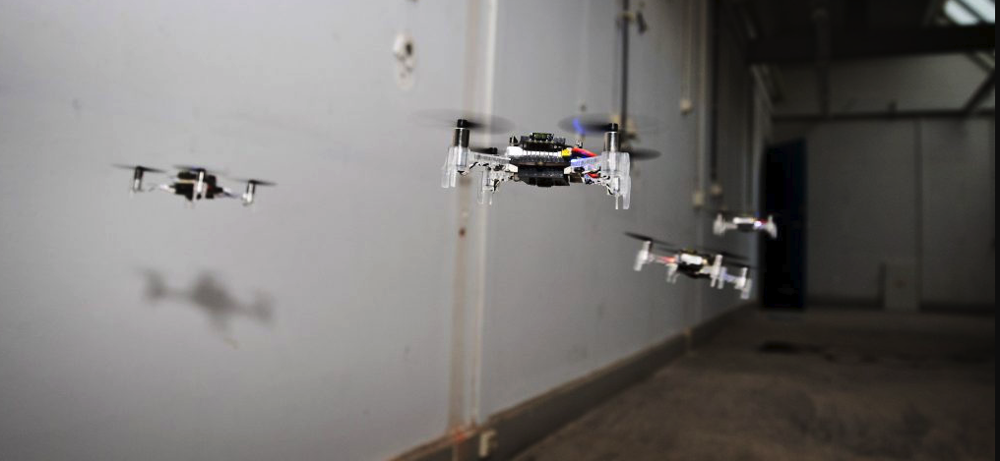
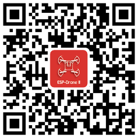
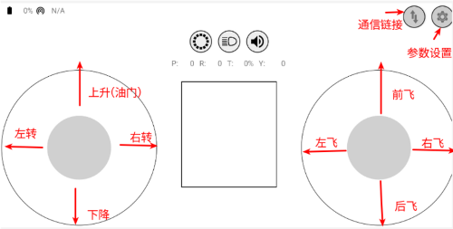
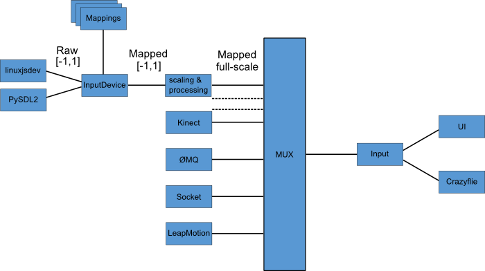

========
快速入门
========

:link_to_translation:`en:[English]`

项目简介
========

ESP-Drone 是基于乐鑫 ESP32/ESP32-S2 开发的小型无人机解决方案，可使用手机
APP 或游戏手柄通过 Wi-Fi
网络进行连接和控制。该方案硬件结构简单，代码架构清晰，支持功能扩展，可用于
STEAM 教育等领域。项目部分代码来自 Crazyflie 开源工程，继承 GPL3.0
开源协议。

.. figure:: ../../_static/espdrone_s2_v1_2_2.png
   :align: center
   :alt: ESP-Drone 无人机
   :figclass: align-center
   
   ESP-Drone 无人机


主要特性
---------

ESP-Drone 具备以下特性：

-  支持自稳定模式 (Stabilize mode)：自动控制机身水平，保持平稳飞行。
-  支持定高模式 (Height-hold mode)：自动控制油门输出，保持固定高度。
-  支持定点模式 (Position-hold
   mode)：自动控制机身角度，保持固定空间位置。
-  支持 PC 上位机调试：使用 cfclient 上位机进行静态/动态调试。
-  支持 APP 控制：使用手机 APP 通过 Wi-Fi 轻松控制。
-  支持游戏手柄 (gamepad) 控制：通过 cfclient 使用游戏手柄轻松控制。


主要组件
----------------

ESP-Drone 2.0 使用模块化的设计思路，由主控板和扩展板组成。

-  **主控制板**：搭载 ESP32-S2 模组和支持基础飞行的必要传感器，并提供硬件扩展接口。
-  **扩展板**：搭载扩展传感器，可对接主控制板的硬件扩展接口，支持高级飞行功能。

==== ========================= ========================= ================== ========================== ==============
序号 模块名                    主要元器件                功能               接口                       安装位置
==== ========================= ========================= ================== ========================== ==============
1    主控制板 - **ESP32-S2**   ESP32-S2-WROVER + MPU6050 基础飞行           提供 I2C SPI GPIO 扩展接口
2    扩展板 - **定点模块**     PMW3901 + VL53L1X         室内定点飞行       SPI + I2C                  底部，面向地面
3    扩展板 - **气压定高模块** MS5611 气压               气压定高           I2C 或 MPU6050 从机        顶部或底部
4    扩展板 - **指南针模块**   HMC5883 罗盘              无头模式等高级模式 I2C 或 MPU6050 从机        顶部或底部
==== ========================= ========================= ================== ========================== ==============

详情可查阅：`硬件参考 <./hardware.rst>`__。

ESP-IDF 简介
================

ESP-IDF 是乐鑫为 ESP32/ESP32-S2 提供的物联网开发框架。

-  ESP-IDF 包含一系列库及头文件，提供了基于 ESP32/ESP32-S2
   构建软件项目所需的核心组件。
-  ESP-IDF
   还提供了开发和量产过程中最常用的工具及功能，例如：构建、烧录、调试和测量等。

详情可查阅：`ESP-IDF
编程指南 <https://docs.espressif.com/projects/esp-idf/zh_CN/latest/esp32s2/get-started/index.html>`__。

Crazyflie 简介
================

Crazyflie 是来自 Bitcraze 开源工程的四旋翼飞行器，具备以下特性：

-  支持多种传感器组合，可以轻松实现定高模式、定点模式等高级飞行模式。
-  基于 FreeRTOS
   编写，将复杂的无人机系统，分解成多个具有不同优先级的软件任务。
-  设计了功能完备的 cfclient 上位机和 CRTP
   通信协议，便于实现调试、测量和控制。



   多架无人机同时探索周围环境，灵活避开障碍物，同时避开其它无人机。\ `A
   swarm of drones exploring the environment, avoiding obstacles and
   each other. (Guus Schoonewille, TU
   Delft) <https://img-blog.csdnimg.cn/20191030202634944.jpg?x-oss-process=image/watermark,type_ZmFuZ3poZW5naGVpdGk,shadow_10,text_aHR0cHM6Ly9ibG9nLmNzZG4ubmV0L3FxXzIwNTE1NDYx,size_16,color_FFFFFF,t_70>`__


详情可查阅 `Crazyflie 官网 <https://www.bitcraze.io/>`__\ 。

准备工作
================

硬件组装
----------

请按照下述步骤组装 ESP32-S2-Drone V1.2：

.. figure:: ../../_static/assembling.png
   :align: center
   :alt: ESP32-S2-Drone V1.2 组装流程
   :figclass: align-center
   
   ESP32-S2-Drone V1.2 组装流程

硬件介绍和管脚资源分配可查阅：\ `硬件参考 <./hardware.rst>`__\ 。

安装 ESP-Drone APP
--------------------

ESP-Drone APP 同时支持 Android 系统和 iOS 系统。

**扫描下方二维码，下载 Android APP：**



**下载 iOS APP：**

在 App Store 中搜索 ESP-Drone，点击下载并安装。

**iOS APP 源代码**：`ESP-Drone-iOS <https://github.com/EspressifApps/ESP-Drone-iOS>`__

**Android APP 源代码**：`ESP-Drone-Android <https://github.com/EspressifApps/ESP-Drone-Android>`__

安装 cfclient
--------------------

安装 cfclient 为可选步骤，用于实现高级调试，非必须使用。

.. figure:: ../../_static/cfclient.png
   :align: center
   :alt: cfclient 上位机界面
   :figclass: align-center

   cfclient 上位机界面


**1. 安装 CRTP 协议支持包**

1.1 下载源代码

.. code:: text

   git clone -b esp-drone  https://github.com/qljz1993/crazyflie-lib-python.git

1.2 进入源码目录，安装依赖

.. code:: text

   pip3 install -r requirements.txt

1.3 安装 CRTP 包

.. code:: text

   pip3 install -e .

**2. 安装 cfclient**

2.1 下载源代码

.. code:: text

   git clone -b esp-drone https://github.com/qljz1993/crazyflie-clients-python.git

2.2 进入源码目录，安装依赖

.. code:: text

   sudo apt-get install python3 python3-pip python3-pyqt5 python3-pyqt5.qtsvg

2.3 安装 cfclient 客户端

.. code:: text

   pip3 install -e .

2.4 启动客户端

.. code:: text

   python3 ./bin/cfclient

**3. 配置遥控器**

.. figure:: ../../_static/gamepad_settings.png
   :align: center
   :alt: 游戏手柄配置
   :figclass: align-center

   遥控器配置

3.1 配置 4 个控制轴：``Roll 、Pitch、Yaw、Thrust``。

3.2 配置一个按键为 ``Assisted control``，用于飞行模式切换。

手机 APP 使用指南
========================

Wi-Fi 连接
---------------------------
* 手机扫描 Wi-Fi AP。ESP-Drone 设备用作 AP，其 SSID 及密码如下：

::

   SSID：ESP-DRONE_XXXX（XXXX 根据 MAC 设置）PASSWORD：12345678

* 点击该 AP，手机与 ESP-Drone 设备建立 Wi-Fi 连接。

个性化设置
-----------

在该步骤中，您可以按照具体的应用场景进行个性化配置，或使用默认配置。

::

   ```
   默认配置：

   Flight control settings 
       1. Mode: Mode2
       2. Deadzone: 0.2
       3. Roll trim: 0.0
       4. Pitch trim: 0.0
       5. Advanced flight control : true
       6. Advanced flight control preferences 
           1. max roll/pitch angle: 15
           2. max yaw angle: 90
           3. max thrust: 90
           4. min thrust: 25
           5. X-Mode: true
   Controller settings 
       1. use full travel for thrust: false
       2. virtual joystick size: 100
   App settings
       1. Screen rotation lock: true
       2. full screen mode:true
       3. show console: true   
   ```

控制飞行
--------

-  打开 APP，点击 `Connect` 按钮，连接小飞机。连接成功，小飞机绿灯闪烁。
-  轻推油门，小飞机起飞。
-  在 APP 上滑动，控制小飞机方向。



   Android APP 用户界面

PC cfclient 使用指南
========================

cfclient 是 ``Crazeflie`` 源工程的上位机，完全实现了 ``CRTP``
协议中定义的功能，可以加快飞机的调试过程。ESP-Drone
项目对该上位机进行裁剪和调整，满足功能设计需求。



   cfclient 架构

.. figure:: ../../_static/cfclient.png
   :align: center
   :alt: cfclient 控制台界面
   :figclass: align-center

   cfclient 控制台界面

项目中有很多相关的文件，例如配置文件和缓存文件，其中 JSON
文件用来存储配置信息。关于配置信息中内容的解读，可参考：`User
Configuration
File <https://www.bitcraze.io/documentation/repository/crazyflie-clients-python/master/development/dev_info_client/>`__。

飞行设置
----------

基本飞行设置 (Basic Flight Control)
~~~~~~~~~~~~~~~~~~~~~~~~~~~~~~~~~~~~~

1. 飞行模式 (Flight mode)：基本模式和高级模式

   -  基本模式 (Normal mode)：初学者使用。
   -  高级模式 (Advanced mode)：设置解锁最大角度，设置最大油门。

2. 自动模式 (Assisted mode)

   -  定海拔模式 (Altitude-hold mode)：保持飞行海拔，需要气压计支持。
   -  定点模式 (Position-hold mode)：保持当前位置，需要光流和 TOF 支持。
   -  定高模式 (Height-hold mode)：保持相对高度，触发时保持高于地面 40
      cm，需要 TOF 支持。
   -  悬停模式 (Hover mode)：触发时保持高于地面 40
      cm，并悬停在起飞点，需要光流和 TOF 支持。

3. 角度修正 (Trim)

   -  翻滚角修正 (Roll Trim)：用于弥补传感器水平安装误差。
   -  俯仰角修正 (Pitch Trim)：用于弥补传感器水平安装误差。

注意，在自动模式下，油门摇杆变为高度控制摇杆。

高级飞行设置 (Advanced Flight Control)
~~~~~~~~~~~~~~~~~~~~~~~~~~~~~~~~~~~~~~

1. 最大倾角 (Max angle)：设置最大允许的俯仰和翻滚角度：roll/pitch。
2. 最大自选速度 (Max yaw rate)：设置允许的偏航速度：yaw。
3. 最大油门 (Max thrust)：设置最大油门。
4. 最小油门 (Min thrust)：设置最小油门。
5. 压摆极限 (Slew limit)：防止油门骤降，油门低于该值时，下降速度将被限定。
6. 压摆率 (Slew rate)：油门到压摆极限之后的最大下降率。

遥控器设置 (Configure Input Device)
~~~~~~~~~~~~~~~~~~~~~~~~~~~~~~~~~~~~~~

按照提示绑定遥控器摇杆与各个控制通道：

.. figure:: ../../_static/gamepad_set.png
   :align: center
   :alt: cfclient 控制器配置
   :figclass: align-center

飞行数据 (Flight Data)
~~~~~~~~~~~~~~~~~~~~~~~~~~

驾驶仪可以看到当前飞机姿态，右下方显示对应的详细数据。

1. 目标角度 (Target)
2. 测量角度 (Actual)
3. 当前油门值 (Thrust)
4. 电机实际输出 (M1/M2/M3/M4)

在线参数修改
--------------------

**在线调整 PID 参数**

.. figure:: ../../_static/cfclient_pid_tune.png
   :align: center
   :alt: PID 参数调整
   :figclass: align-center
   
   cfclient PID 参数调整

**注意事项**

1. 修改的参数实时生效，避免了频繁烧录固件。
2. 可在代码中通过宏定义，配置哪些参数可被上位机实时修改。
3. 注意，参数在线修改仅用于调试，掉电不保存。


飞行数据监控
--------------------

**配置要监控的参数**

.. figure:: ../../_static/log_set.png
   :align: center
   :alt: PID 参数调整
   :figclass: align-center

   监控参数配置

.. figure:: ../../_static/log_set2.png
   :align: center
   :alt: PID 参数调整
   :figclass: align-center

   参数配置区

**实时波形绘制**

陀螺仪加速度计实时数据监测：

.. figure:: ../../_static/log_acc.png
   :align: center
   :alt: PID 参数调整
   :figclass: align-center

   陀螺仪加速度计数据监测

螺旋桨方向
================

-  按照下图所示位置，安装 A、B 螺旋桨。
-  飞行器上电自检时，检查螺旋桨转向是否正确。

.. figure:: ../../_static/espdrone_s2_v1_2_diretion2.png
   :align: center
   :alt: 螺旋桨方向示图
   :figclass: align-center

   螺旋桨方向示图

起飞前检查
================

-  将飞机头部朝前放置，尾部天线朝向自己。
-  将飞机置于水平面上，待机身稳定时上电。
-  观察上位机水平面是否置平。
-  观察通信建立以后，小飞机尾部绿灯是否快速闪烁。
-  观察小飞机头部红灯是否熄灭，亮起代表电量不足。
-  轻推左手小油门，检查飞机是否能快速响应。
-  轻推右手方向，检查方向控制是否正确。
-  起飞吧！
